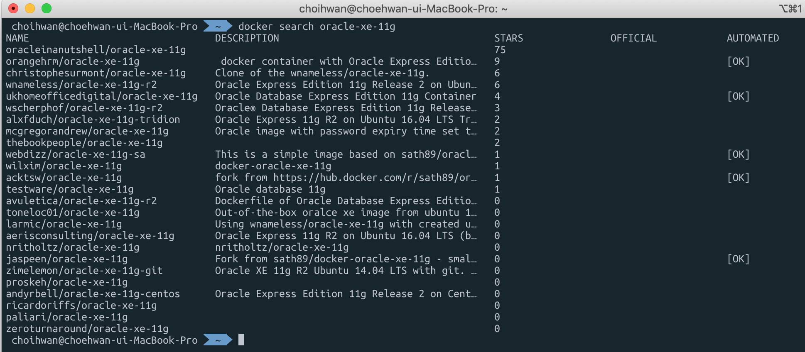
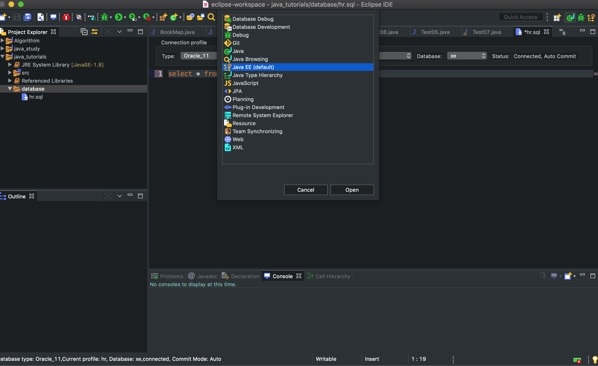
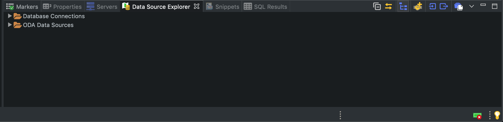
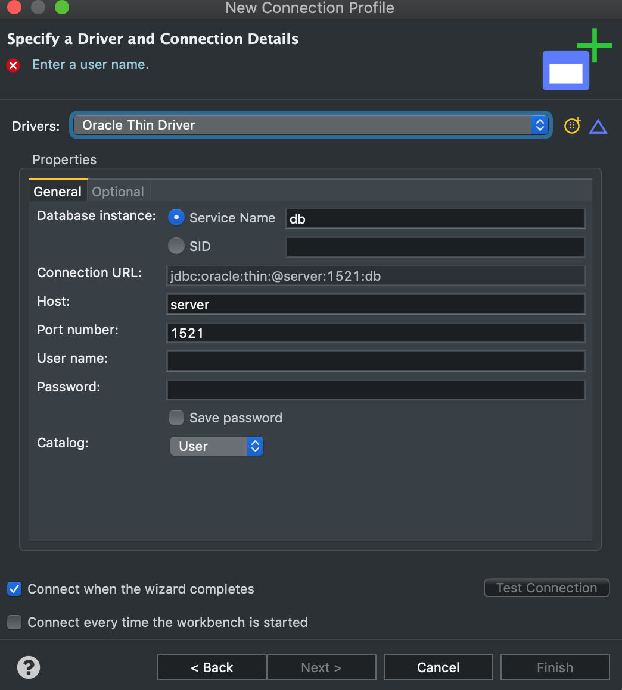

## 시작하기 앞서서

멀티캠퍼스 데이터베이스 수업시간에 Oracle 데이터베이스를 활용하는 수업을 진행하였다. 처음으로 배우는 데이터베이스다 보니 뭔가 개념적으로 확실하게 이해되는 것이 좀 부족했던 것 같아 집에서 더 공부를 하고자 노트북을 키게 됐다. 그러나... 내가 사용하는 맥북에서는 Oracle 데이터베이스 설치가 바로는 불가하다는 것을 알게되었다...

## Docker

그래서 구글링 결과! Docker라는 것을 통해 설치를 할 수 있다는 것을 알게되었고 바로 시도하기로 하였다. 여기서 Docker란 컨테이너 기반의 오픈소스 가상화 플랫폼으로 실행 환경에 상관없이 동일한 환경을 제공해주는(?) 아주 편리한 녀석인 것 같았다. 지금 나의 상황으로는 컨테이너 기반은 뭔지.. 또 이게 어떻게 동작하는지 잘 알 수 없기에 후에 공부하고 알게되면 그 때 또 포스트를 작성하도록 하겠다.

먼저 [Docker 홈페이지](https://hub.docker.com/editions/community/docker-ce-desktop-mac)로 접속하여 가입 후 다운을 받았고 실행까지 성공하였다. 실행을 하고 나면 이제 터미널에서 docker 명령어들을 사용가능한데 터미널에서 **docker search oracle-xe-11g** 를 입력하여 다운로드할 이미지들을 검색하였다.

나는 [여기](https://whitepaek.tistory.com/40)블로그를 보면서 했기 때문에 똑같이 **jaspeen/oracle-xe-11g**를 다운 받아 진행하였고 

**docker run --name oracle11g-test -d -p 8080:8080 -p 1521:1521 jaspeen/oracle-xe-11g** 이 명령어를 통해 docker에서 컨테이너 생성과 실행을 할 수 있었다.

그 후 **docker exec -it oracle11g-test sqlplus** 입력으로 오라클 데이터베이스 실행을 성공할 수 있었다! 아마 나보다는 위에 설명해놓은 블로그가 더 예쁘고 자세히 설명해 놓았으니.. 저걸 보고 따라하는게 더 좋을 것 같기도 하다.

정지 후 다시 시작할때는 **docker start oracle11g-test** 으로 docker에서 실행한 후 진행 할 수 있으면 될 것 같다.

## Eclipse에서의 Oracle Databas연동

그 후에 나머지 SQL devloper라던가.. 나머지 환경 설정은 쉽게 할 수 있었다. 하지만.. 이클립스에서 바로바로 확인 할 수 있는 환경을 하기 위해서는 또 다른 설정이 필요하였다. 먼저 [이곳](https://www.oracle.com/database/technologies/jdbcdriver-ucp-downloads.html) 에서 ojdbc6.jar 를 다운 받고 시작하자.

도커와 다른 설정을 마쳤으면 이클립스에서의 Perspective 를 java EE로 설정해주자.

그 후 아래의 DataSource Explorer에 있는 Database Connections에서 하나를 생성하자.

후에 창에서 Driver 칸 옆에 있는 톱니바퀴를 클릭하자. 제 Theme 에서는 노란색 파인애플 처럼 생겼군요.

그 다음 Oracle Thin Driver 버전 11를 선택하고 jar List에 있는 것을 모두 삭제하고 처음 받았던 ojdbc6.jar를 추가하고 User name과 Password를 적고 Test Connection후 성공이 나온다면 데이터베이스 공부를 시작하도록 하자!! 참고로 포트 번호는 글마다 다르던데 처음에 docker에서 명령어 사용으로 다르게 설정하거나 그럴 수 있는 것 같다.

> 나라가 이상하다고 나오는 경우가 있는데 그럴때는 시스템 환경설정에서 언어 및 지역을 미국으로 바꾸고 다시 한국으로 한다음 껐다가 키고 다시 하면 된다는 소리가 있다. SQL developer에서도 마찬가지로..