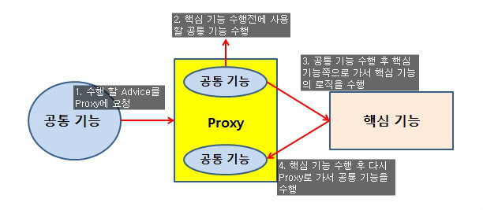
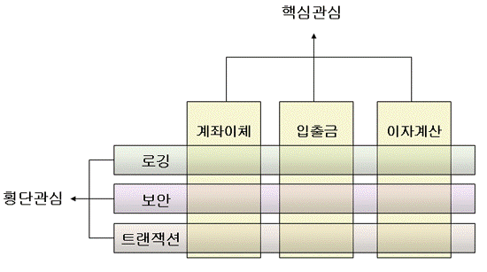
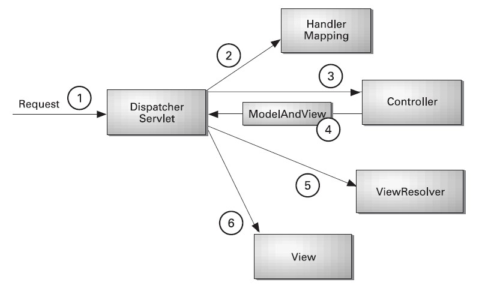

## 시작하기에 앞서

2일차 스프링과 3일차 스프링 정리


## AOP(ASPECT ORIENTED PROGRAMMING)

- aspect : 모든 스프링 클래스 공통 구현 사항들
- 공통관심코드=횡단관심코드=핵심관심코드 구현 공통 필요 반복 구현 사항들





### 사용 하는 방법

1. 스프링 프로젝트 기본 jar 라이브러리 파일들 다운로드
2. aop 관련 라이브러리 추가 [다운로드](https://mvnrepository.com/) 
3. aspect 클래스 정의 (공통관심)
4. target 클래스 정의 (핵심관심)
5. pointcut 문법 (공통(메소드:a) 

```xml
<?xml version="1.0" encoding="UTF-8"?>
<beans xmlns="http://www.springframework.org/schema/beans"
	xmlns:xsi="http://www.w3.org/2001/XMLSchema-instance"
	xmlns:aop="http://www.springframework.org/schema/aop"
	xsi:schemaLocation="http://www.springframework.org/schema/beans http://www.springframework.org/schema/beans/spring-beans.xsd
		http://www.springframework.org/schema/aop http://www.springframework.org/schema/aop/spring-aop-4.3.xsd">
	
	<bean id="member" class="aop1.Member" />
	<bean id="board" class="aop1.Board" />
	<bean id="common" class="aop1.Common" />
	
	<aop:config>
		<aop:pointcut expression="execution (public * aop1.*.*(..))" id="pc"/>
		<!-- modifier 리턴타입 패키지명.클래스명.메소드(매개변수개수) 
		<aop:pointcut expression="execution (public *[리턴타입] aop1[패키지명].*[클래스].*[메소드](..)[매개변수])" id="pc"/>
		* : 모든
		(..) : 모든 매개변수
		.. : 하위패키지 포함
		-->
		<aop:aspect id="aspect1" ref="common">
<!-- 			<aop:before method="a" pointcut-ref="pc"/>
			<aop:after method="b" pointcut-ref="pc"/> -->
			<aop:around method="c" pointcut-ref="pc"/>
		</aop:aspect>
	</aop:config>
</beans>

```


- Annotaion 을 활용한 AOP

```xml
<?xml version="1.0" encoding="UTF-8"?>
<beans xmlns="http://www.springframework.org/schema/beans"
	xmlns:xsi="http://www.w3.org/2001/XMLSchema-instance"
	xmlns:aop="http://www.springframework.org/schema/aop"
	xmlns:context="http://www.springframework.org/schema/context"
	xsi:schemaLocation="http://www.springframework.org/schema/beans http://www.springframework.org/schema/beans/spring-beans.xsd
		http://www.springframework.org/schema/context http://www.springframework.org/schema/context/spring-context-4.3.xsd
		http://www.springframework.org/schema/aop http://www.springframework.org/schema/aop/spring-aop-4.3.xsd">

	<context:component-scan base-package="annotaion.aopexam"> </context:component-scan>
	<aop:aspectj-autoproxy/> <!--Annotaion으로 연결만 잘되어있다면 한방에 해결.. -->


</beans>

```

### AOP in Annotaion

- @Aspect`: 공통 관심 클래스 위에 선언

- `@PointCut`: 메소드 내 부 내용을 구현하지 않고 위에 선언후 경로를 설정.

  ```java
  @Component
  @Aspect
  public class AnimalAspect {
  	
  	@Pointcut("execution (public * annotaion.aopexam.*.*(..))")
  	public void eat() { };
  	
  	@Before("eat()")
  	public void whatEat() {
  		System.out.println("오늘 점심에 뭐 먹었어요?");
  	}
  
  	@AfterReturning(pointcut= "eat()", returning = "returning")
  	public void afterEat(Object returning) {
  		try {
  			if (returning != null) {
  				System.out.println(returning + "먹습니다");
  			}
  		} catch (Throwable e) {
  			// TODO Auto-generated catch block
  			e.printStackTrace();
  		}
  	}
  }
  ```


# FrontControlller 패턴 + MVC 패턴

1. FrontControllerServlet 호출 (모든 url 을 받아옴)

```java
public class FrontControllerServlet extends HttpServlet {
	private static final long serialVersionUID = 1L;

	protected void doGet(HttpServletRequest request, HttpServletResponse response)
			throws ServletException, IOException {
		// 1. 모든요청은 FrontController 로 들어옴.
		// 2. uri 가장 뒤 요소 분석 http.../hello
		response.setContentType("text/html;charset=UTF-8");
		PrintWriter out = response.getWriter();
		out.println("<h1> FrontControllerServlet </h1>");
		out.println(request.getRequestURL());
		out.println(request.getRequestURI());

		String s[] = request.getRequestURI().split("/");
		// 3. hello - 일시키자 --MVC --> SPRING 의 내부환경을 이해해 보자!
		HandlerMapping mapping = new HandlerMapping();
		Controller controller = mapping.getController(s[s.length - 1]);
		String viewName = controller.handleRequest(request, response);

		RequestDispatcher rd = request.getRequestDispatcher(viewName);
		rd.forward(request, response);
	}
}
```

2. HelloController 호출

- xxxController : handleRequest 를 갖는다는 약속(인터페이스로 구성)

```java
import java.io.IOException;
import java.io.PrintWriter;

import javax.servlet.RequestDispatcher;
import javax.servlet.ServletException;
import javax.servlet.http.HttpServlet;
import javax.servlet.http.HttpServletRequest;
import javax.servlet.http.HttpServletResponse;

public interface Controller {
	public String handleRequest(HttpServletRequest request, HttpServletResponse response);
}

public class HelloController implements Controller {
	public String handleRequest(HttpServletRequest request, HttpServletResponse response) {
		System.out.println("HelloController 실행중입니다.");
		//servlet ---> jsp 데이터 전달 = 공유
		request.setAttribute("model", "Hello Spring");
		return "/Hello.jsp";
		//request.getAttribute("model");
		//${model}
	}
}

public class HandlerMapping {
	HashMap<String, Controller> mappings;

	public HandlerMapping() {
		mappings = new HashMap<String, Controller>();
		mappings.put("hello", new HelloController());
	}
	
	public Controller getController(String name) {
		return mappings.get(name);
	}
}
```

3. "hello spring" 문자열값 생성(model)

4.  hello.jsp 가 출력(view)

   ---> hello.jsp

```html
<%@ page language="java" contentType="text/html; charset=UTF-8"
    pageEncoding="UTF-8"%>
<!DOCTYPE html>
<html>
<head>
<meta charset="UTF-8">
<title>스프링 mvc 테스트</title>
</head>
<body>
<h1>컨트롤러 에서 전달 받은 값 : ${model}</h1>
<h1>컨트롤러 에서 전달 받은 값 : <%=request.getAttribute("model") %></h1>
</body>
</html>
```


- spring bean configutartion file => di, aop

- spring mvc configuration file => di, aop , mvc (ex: servlet-context.xml)

- web server configuration file => spring mvc , servlet.jsp(web.xml)

> model - 용어 /개념 -view 보여줄 데이터(생성+결과)


##  spring mvc xml 태그설정 &  annotaion 설정

들어가기 앞서서 일단 Spring MVC가 어떻게 동작하는지 보고가자.




**Spring MVC**내에서 처리되는 하나의 요청에 대한 Life Cycle과정은 위 그림과 같다.

클라이언트의 요청에 대한 최초 진입 지점은 DispatcherServlet이 담당하게 된다. 대부분의 MVC를 지원하는 프레임워크가 메인 Servlet을 가지는 것처럼 Spring MVC 또한 메인 Servlet이 최초 진입지점으로 다음의 작업을 처리하게 된다. 

**DispatcherServlet**은 Spring Bean Definition에 설정되어 있는 Handler Mapping 정보를 참조하여 해당 요청을 처리하기 위한 Controller를 찾는다.

**DispatcherServlet**은 선택된 Controller를 호출하여 클라이언트가 요청한 작업을 처리한다.** 

**Controller**는 Business Layer와의 통신을 통하여 원하는 작업을 처리한 다음 요청에 대한 성공유무에 따라 ModelAndView 인스턴스를 반환한다. ModelAndView 클래스에는 UI Layer에서 사용할 Model데이터와 UI Layer로 사용할 View에 대한 정보가 포함되어 있다.

**DispatcherServlet**은 ModelAndView의 View의 이름이 논리적인 View 정보이면 ViewResolver를 참조하여 이 논리적인 View 정보를 실질적으로 처리해야할 View를 생성하게 된다.

**DispatcherServlet**은 ViewResolver를 통하여 전달된 View에게 ModelAndView를 전달하여 마지막으로 클라이언트에게 원하는 UI를 제공할 수 있도록 한다. 마지막으로 클라이언트에게 UI를 제공할 책임은 View 클래스가 담당하게 된다.


코드로 한번 확인해보자. web-xml 밑부분을 보자.

```xml
	<servlet>
		<servlet-name>appServlet</servlet-name>
		<servlet-class>org.springframework.web.servlet.DispatcherServlet</servlet-class>
		<init-param>
			<param-name>contextConfigLocation</param-name>
			<param-value>/WEB-INF/spring/appServlet/servlet-context.xml</param-value>
		</init-param>
		<load-on-startup>1</load-on-startup>
	</servlet>

	<servlet-mapping>
		<servlet-name>appServlet</servlet-name>
		<url-pattern>/</url-pattern>
	</servlet-mapping>
```

> 이 부분에서 DispatcherServlet 쪽으로 연결이되어서 Controller쪽에 연결을 해준다고 생각하면된다.

그후 src\main\webapp\WEB-INF\spring\appServlet안에 있는 servlet-context.xml 을 보자

```xml
<?xml version="1.0" encoding="UTF-8"?>
<beans:beans
	xmlns="http://www.springframework.org/schema/mvc"
	xmlns:xsi="http://www.w3.org/2001/XMLSchema-instance"
	xmlns:beans="http://www.springframework.org/schema/beans"
	xmlns:context="http://www.springframework.org/schema/context"
	xsi:schemaLocation="http://www.springframework.org/schema/mvc https://www.springframework.org/schema/mvc/spring-mvc.xsd
		http://www.springframework.org/schema/beans https://www.springframework.org/schema/beans/spring-beans.xsd
		http://www.springframework.org/schema/context https://www.springframework.org/schema/context/spring-context.xsd">

	<!-- DispatcherServlet Context: defines this servlet's request-processing 
		infrastructure -->

	<!-- Enables the Spring MVC @Controller programming model -->
	<annotation-driven />
	<!-- @Componet @Service @Repository @Autowired -->
	<context:component-scan base-package="edu.multi.mvc" />

	<!-- Handles HTTP GET requests for /resources/** by efficiently serving 
		up static resources in the ${webappRoot}/resources directory -->
	<resources mapping="/resources/**" location="/resources/" />

	<!-- Resolves views selected for rendering by @Controllers to .jsp resources 
		in the /WEB-INF/views directory -->
	<beans:bean
		class="org.springframework.web.servlet.view.InternalResourceViewResolver">
		<beans:property name="prefix" value="/WEB-INF/views/" />
		<beans:property name="suffix" value=".jsp" />
	</beans:bean>

<!-- 	1.xml 태그 spring mvc 설정
	<beans:bean id="hc" class="test.HelloController" />
	<beans:bean id="board" class="test.BoardController" />

	<beans:bean id="urlMapping"
		class="org.springframework.web.servlet.handler.SimpleUrlHandlerMapping">
		<beans:property name="mappings">
			<beans:props>
				<beans:prop key="/hello">hc</beans:prop>
				<beans:prop key="/board">board</beans:prop>
			</beans:props>
		</beans:property>
	</beans:bean> -->
    
</beans:beans>

```

꽤 많은 설정들이 있는데 주석들을 읽으면 어떠한 역활을 하는지 알 수 있다. 마지막 주석 문단은 이제 위에서 사용했던 코드들을 Spring식으로 변환하기 위한 설정들.

실습에서는 DAO 클래스와 VO 클래스들을 만들고 jdbc로 연결을 통해 작업을 해보았는데 그것은 제외히고 HelloController만 보면

```java
public class HelloController implements Controller {

	@Override
	public ModelAndView handleRequest(HttpServletRequest request, HttpServletResponse response) {
		System.out.println("HelloController 실행중입니다.");
		
		ModelAndView mv = new ModelAndView();
		//servlet ---> jsp 데이터 전달 = 공유 == Model
		mv.addObject("model","Hello Spring"); // request.setAttribute()
		mv.setViewName("hello"); //view 세팅
		return mv;
	}
}
```

이렇게 위에서 써있는대로 `ModelAndView` 객체를 만들고 그것을 전달하여 view를 생성한다.

그걸로 생성해낸 hello.jsp 코드다.

```html
<%@ page language="java" contentType="text/html; charset=UTF-8"
    pageEncoding="UTF-8"%>
<!DOCTYPE html>
<html>
<head>
<meta charset="UTF-8">
<title>스프링 mvc 테스트</title>
</head>
<body>
<h1>컨트롤러 에서 전달 받은 값 : ${model}</h1>
<h1>컨트롤러 에서 전달 받은 값 : <%=request.getAttribute("model") %></h1>
</body>
</html>
```


이걸이제 Annotaion 형식으로 한번 바꿔보자!

먼저 MVC형식의 Annotaion 을 사용하기 위해서는 servlet-context.xml 파일에서 추가가 필요하다.

(사실 이미 위에도 추가되어있다. 주석으로 써진 이유가 이미 내 코드가 Annotaion 이기 때문..)

```xml
	<!-- Enables the Spring MVC @Controller programming model -->
	<annotation-driven />
```

요 한줄..이 핵심이다. 잘 생각해보자.

그리고 변경된 HelloController

```java
@Controller
public class HelloController{
	
	@RequestMapping("/hello") //<beans:prop key = "/hello">hc<beans:prop>
	public ModelAndView handleRequest(HttpServletRequest request, HttpServletResponse response) {
		System.out.println("HelloController 실행중입니다.");
		
		ModelAndView mv = new ModelAndView();
		//servlet ---> jsp 데이터 전달 = 공유 == Model
		mv.addObject("model","Hello Spring(어노테이션)"); //request.setAttribute()
		mv.setViewName("hello"); //view 세팅 없으면 annotaion과 같은 이름으로 만들어줌.
		return mv;
	}
}
```

mv.setViewName 같은 경우 후에 다시 설명해준다고 하셨다. Annotaion 설정시 있어도 없어도 된다고는 하는데.. 한번 공부해보자.


@Controller

@RequestMapping("/context명")

@RequestMapping(name="/hello" , method=RequestMethod.GET)

- GET
  - http:...login?name1=value1&name2=value2
  - url 뒤 요청 파라미터 값을 적어 전송 방식 : GET방식이다!
  - url?변수명1=값1
  - 특수문자나 한글 인코딩하여 전송
  - url 공백은 포함하면 안된다.
  - url 길이 제한


- POST(기본적으로 GET방식을 가지며)
  - 전송 파라미터 값이 우리 눈에 보이지 않음.
  - 전달 길이 무제한
  - 파일 업로드, 암호 전송

```java
@Controller
public class LoginController {

	@RequestMapping(name = "/login", method = RequestMethod.GET)
	// 1. Request매핑 메소드 리턴타입 String
	// 뷰이름으로 되는 규칙이 있음. 모델은 필요없고 뷰의 이름만 필요할때는 이렇게 사용하는게 좋다
	public String loginform() {

		// 로그인폼 출력

		return "loginform";
	}

	@RequestMapping(name = "/login", method = RequestMethod.POST)
	public ModelAndView loginSuccess(HttpServletRequest request) {
		ModelAndView mv = new ModelAndView();
		mv.addObject("loginresult", true);
		mv.setViewName("loginsuccess");
		return mv;
	}
}
```

이렇게 같은 url 요청이여도 그것이 어떤 방식으로 가냐에 따라서 다른 jsp 페이지를 요청 할 수도 있다는 것을 기억하자!