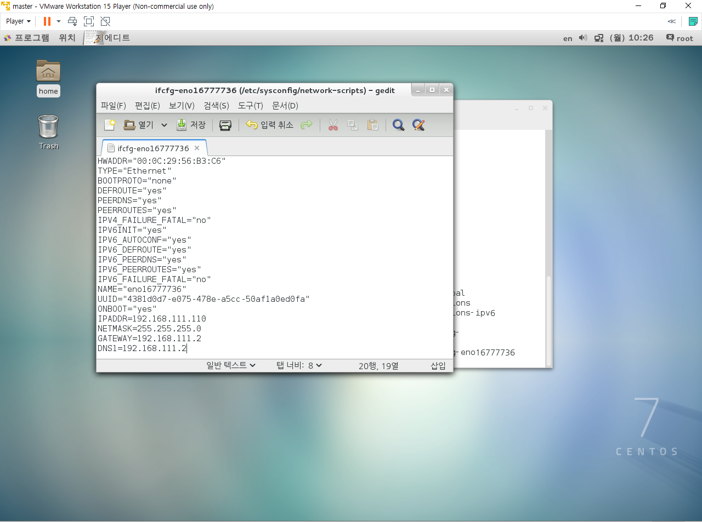
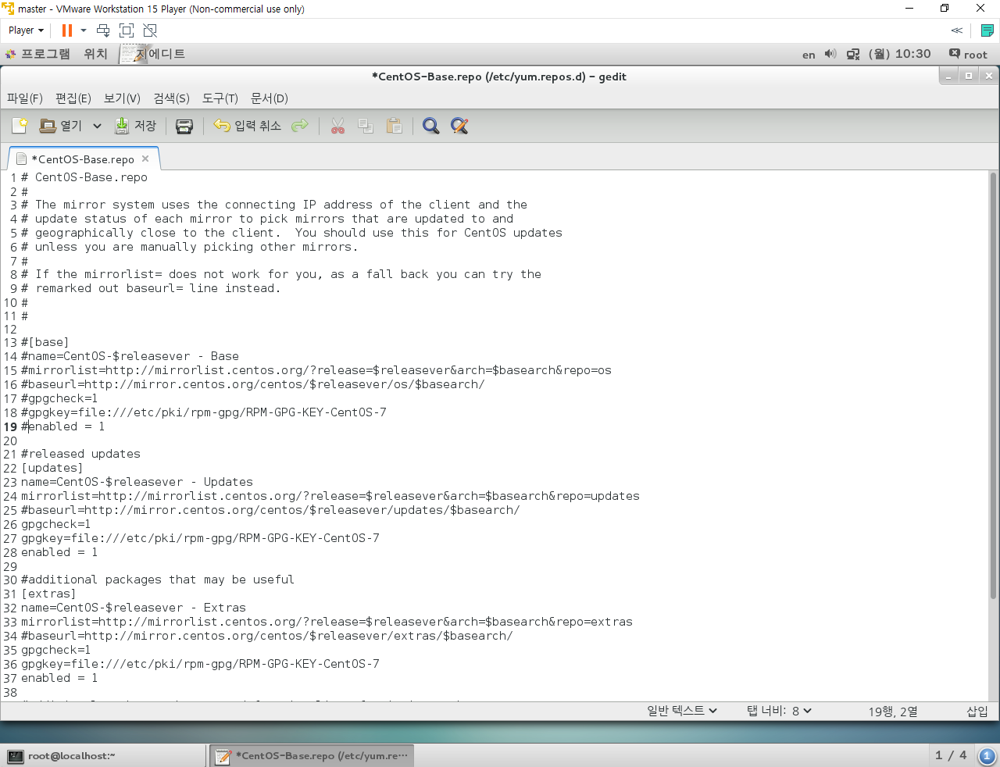
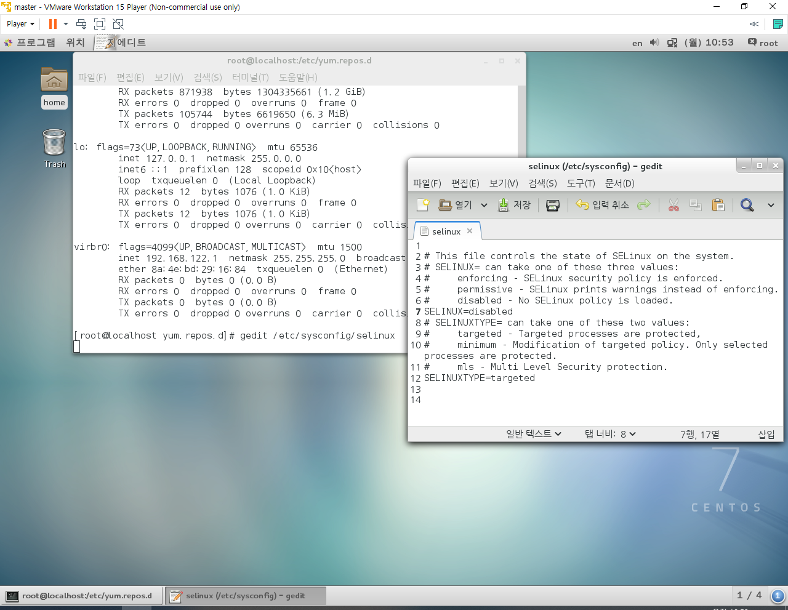
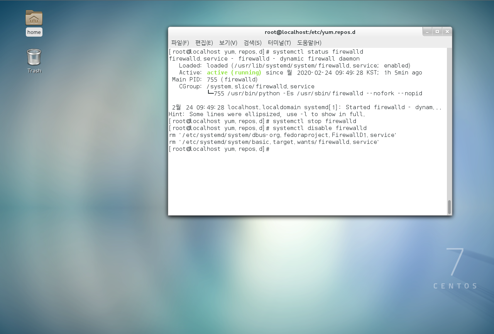
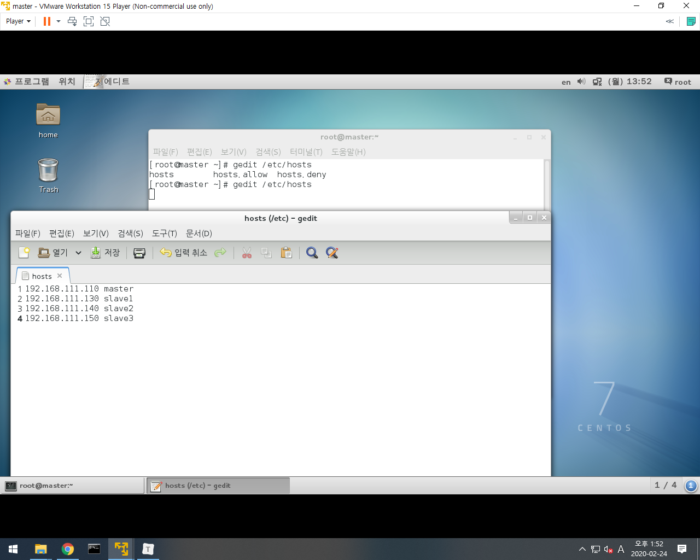
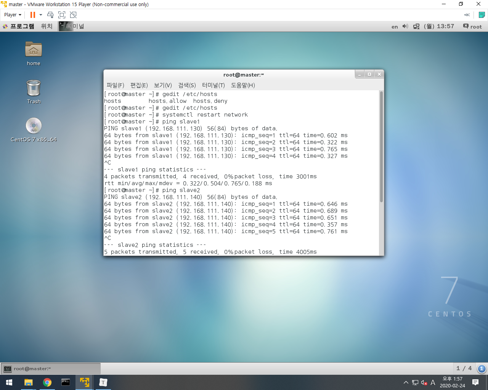
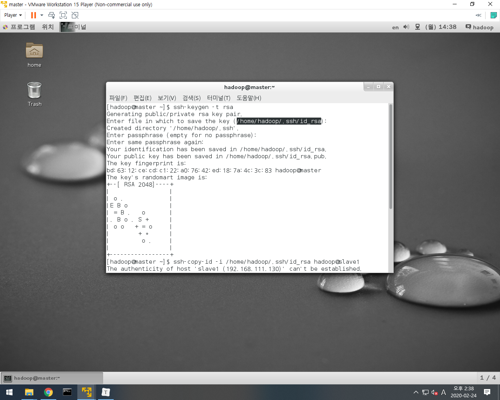
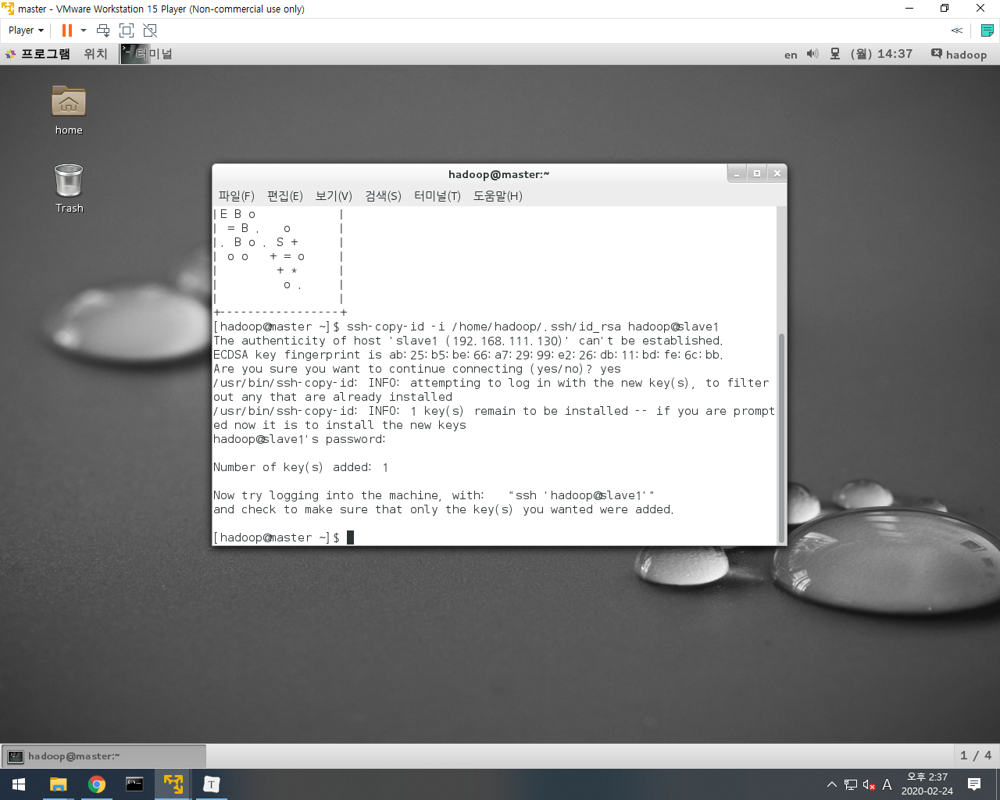
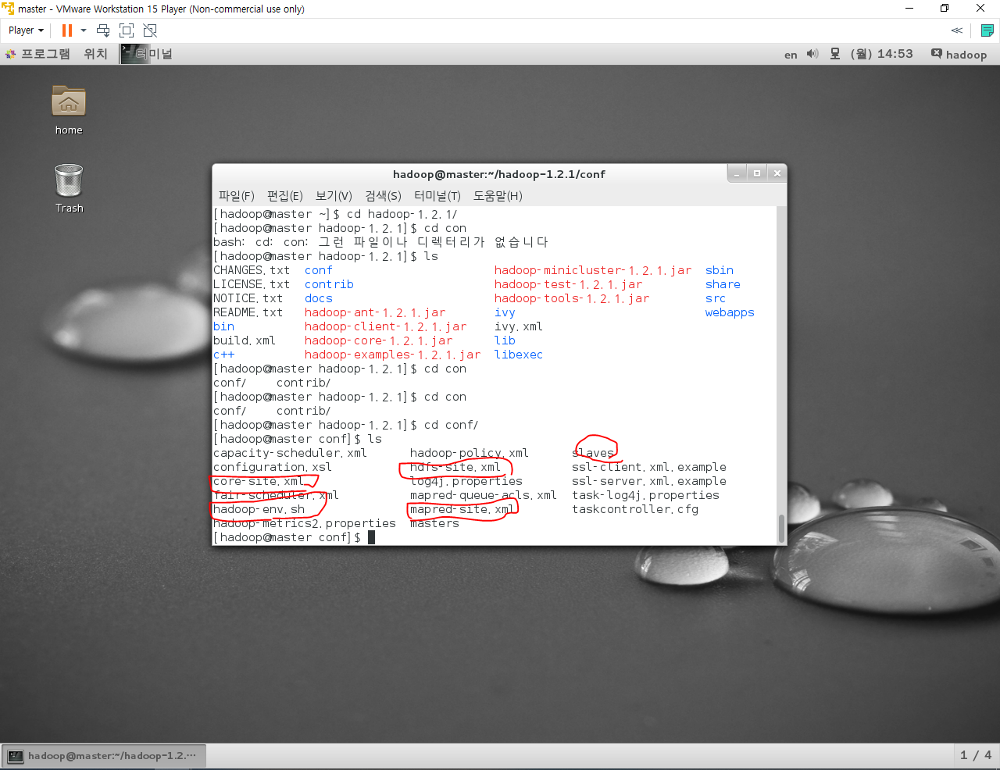
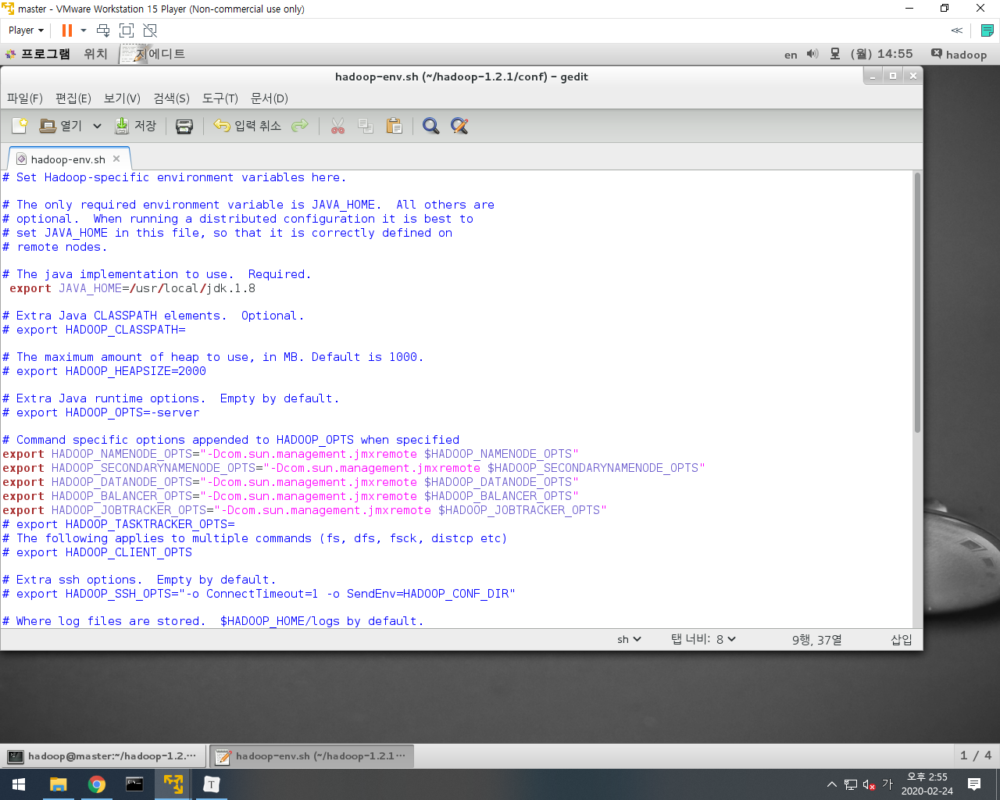

## hadoop 환경설정

1> vm / 리눅스 설치

-yum 업데이트 방지 설정



- CentOS-Baserepo 설정



- CentOS-Sources.repo 설정


> 프로그램의 소프트웨어에서 자동업그레이드 켜져있는 것들을 다 꺼주면 된다. + 소프트웨어 공급원에서 확인도 안함으로 변경하기!

2> selinux 방지설정



3> 방화벽 해제(root)

systemctl status firewalld 확인후 해제




rpm -qa | grep jdk 를 하면 자바가 잡힘

yum remove java 를 하면 삭제

후에 다시 쳐보면 잡히는게 없다 그후에 새로운 jdk 를 설치하자.

> jdk 설치는 스킵! 압축을 풀고 환경변수를 설정하자!


4> hadoop 설치

/root/다운로드/*

/home/사용자명디렉토리/다운로드/hadoop


*우리는 완전분산 모드로 하둡을 구성한다*


---


가상머신 세개를 더 만들어주면서 network 에서 새로운 키값을 생성한다음 넣어주자.

slave 1

00:50:56:3F:87:A4

slave2

00:50:56:2E:92:37

slave3

00:50:56:20:EE:19


gedit /etc/sysconfig/network-scripts/ifcfg-eno~~~ -> 여기서 아이피설정

hostnamectl set-hostname [호스트네임]

systemctl restart network 로 네트워크 다시 설정하고 조금의 시간 이후 다시 변경됐는지 ifconfig 로 확인해보자.




그후 셋다 systemctl restart network 후에 master에서 ping 으로 확인해보자




후에 다른 slave로 접속할때 을 할때 비밀번호 입력을 피하기 위해서 암호키를 생성하고 복사해준다.

- 암호키생성(참고로 root 계정이 아닌 사용자계정인 hadoop 에서 작업한다.)



- 암호키 복사




그다음 master 계정에서 몇가지 파일을 수정해야한다. 



요 빨간 네모들을 하나씩 수정해보자

- hadoop-env.sh



> export 쪽이 주석되어있을텐데 바꿔줘야한다.


- masters

들어가보면 localhost 일텐데 그걸 마스터 다음의 슬레이브중에 하나로 설정을한다 ex)slave1 으로

- slaves


> localhost 라고 되어있을텐데 slave가 될 아이들을 넣어준다.


- 마스터에서 xml 세개를 설정해준다.

```xml
gedit hadoop-1.2.1/conf/core-site.xml

<configuration>
  	  <property>
    	    <name>fs.default.name</name>
            <value>hdfs://master:9000</value>
          </property>
          <property>
            <name>hadoop.tmp.dir</name>
            <value>/home/hadoop/hadoop-data/</value>
          </property>
</configuration>


gedit hadoop-1.2.1/conf/hdfs-site.xml

<configuration>
  	  <property>
    	    <name>dfs.replication</name>
     	    <value>3</value>
  	  </property>
  	  <property>
    	    <name>dfs.http.address</name>
    	    <value>master:50070</value>
  	  </property>
  	  <property>
    	    <name>dfs.secondary.http.address</name>
    	    <value>slave1:50090</value>
  	  </property>
</configuration>


gedit hadoop-1.2.1/conf/mapred-site.xml
 	<configuration>
  	  <property>
   	    <name>mapred.job.tracker</name>
   	    <value>master:9001</value>
  	  </property>
</configuration>
```


scp hadoop-env.sh hadoop@slave1:/home/hadoop/hadoo-1.2.1/conf

-> slave1에 hadoop-env.sh 파일을 보내준다. 뒤의 경로에

나머지 두개도 똑같이 진행한다.


scp *-site.xml hadoop@slave1:/home/hadoop-1.2.1/conf

로 변경한 xml 세개를 다 보내준후 source /home/hadoop/.bash_profile 로 변경사항을 적용한다


그후 hadoop namenode -format 이라는 명령어로 하둡을 포맷시켜 실행준비

start-all.sh 를 실행하여 하둡을 실행한다.

그다음 jps 로 연결이 되어있는지 각각 슬레이브들과 마스터에서 확인.


이렇게 하둡 설정이 완료된다.. 힘들어..