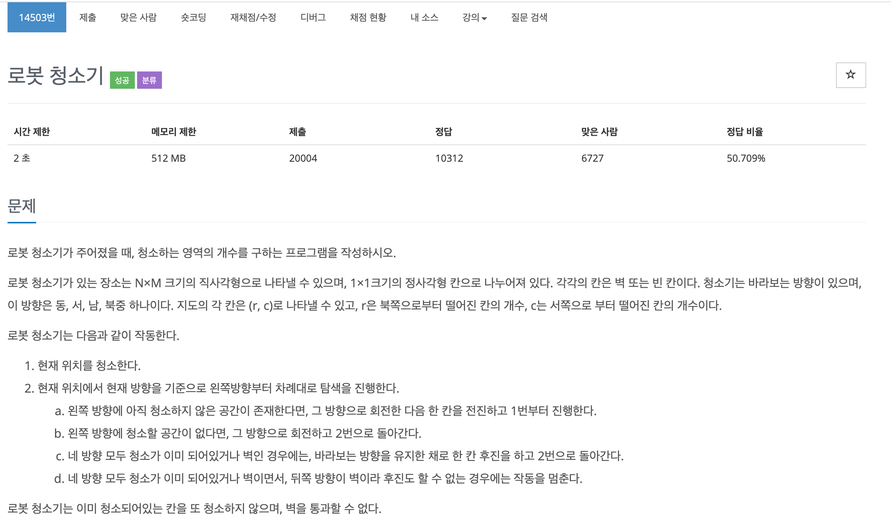
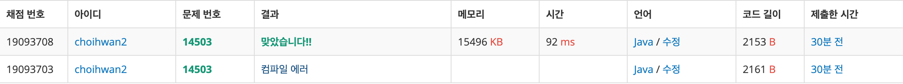

## 문제[#](https://www.acmicpc.net/problem/14503)



## 풀이 및 주저리..

백준에 있는 분류보기로 시뮬레이션을 풀어보려다가 문제를 접하게 되었다. 처음에 정답 비율이 50%인 것을 보고 그냥 달려들었다가 크게 당하고... 엄청나게 시간이 오래걸려서 풀게 되었다. 지금까지 알고리즘을 풀면서 가장 크게 느끼는 것이 내가 문제에 대한 이해가 많이 부족한 상태로 코드를 작성하기 시작하는 것인 것 같다. 이번에도 역시나.. 스스로 문제를 풀때는 이해가 됐다고 생각했지만 마지막에 y가 위로 갈 수록 작아진다는 것을 놓쳐서 정말 한참동안 헤멘 것 같다. 디버깅도 해보고.. 진짜 시험때는 이럴 시간도 없고 해볼수도 없는 과정인데.. 문제를 풀어보고 구글링 해보니 삼성 SW 역량 기출문제였고.. 이정도의 문제가 나올때 내가 IDE 없이 이 문제를 풀 수 있을까 많은 고민을 하게 만든 문제였다. 


풀이는 정말.. 문제에 쓰여져 있는대로만 구현하면 된다. 하지만 그게 너무나도 어려웠다는게 함정. 이런 문제가 참.. 많이 나오는 것 같다. 계속해서 수련하도록 하자!

## 코드

```java
package backjoon.algorthim.simulation;

import java.io.BufferedReader;
import java.io.IOException;
import java.io.InputStreamReader;

public class Problem14503 {
	static final int[] DIR = { 3, 0, 1, 2 };
	static final int[][] C_DIR = { { 0, -1 }, { -1, 0 }, { 0, 1 }, { 1, 0 } }; // y, x 의 오른쪽
	static final int[][] R_DIR = { { 1, 0 }, { 0, -1 }, { -1, 0 }, { 0, 1 } }; // y, x 의 반대방향
	static int x, y, dir;
	static char[][] map;
	static int rotation;
	static boolean isMove = true;
	static int answer = 0;

	public static void main(String[] args) throws IOException {
		BufferedReader br = new BufferedReader(new InputStreamReader(System.in));
		String[] xy = br.readLine().split(" ");
		int map_h = Integer.parseInt(xy[0]);
		int map_w = Integer.parseInt(xy[1]);

		map = new char[map_h][map_w];

		String[] roboXY = br.readLine().split(" ");
		y = Integer.parseInt(roboXY[0]);
		x = Integer.parseInt(roboXY[1]);
		dir = Integer.parseInt(roboXY[2]);

		for (int i = 0; i < map_h; i++) {
			String input = br.readLine().replace(" ", "");
			map[i] = input.toCharArray();
		}

		while (isMove) {
			cleanArea();
			checkArea();
		}
		System.out.println(answer);

	}

	public static void cleanArea() {
		if (map[y][x] == '0') {
			map[y][x] = '2';
			answer++;
		}
	}

	public static void checkArea() {
		rotation = 0;
		while (rotation < 4) {
			if (map[y + C_DIR[dir][0]][x + C_DIR[dir][1]] == '0') {
				y += C_DIR[dir][0];
				x += C_DIR[dir][1];
				dir = DIR[dir];
				return;
			} else {
				dir = DIR[dir];
				rotation++;
			}
		}

		if (map[y + R_DIR[dir][0]][x + R_DIR[dir][1]] == '1') {
			isMove = false;
			return;
		} else {
			y += R_DIR[dir][0];
			x += R_DIR[dir][1];
			return;
		}

	}
}
```





## 기억에 남길 것!

- String.trim() 은 문자열이 시작되기 전과 후의 공백만 없애준다. 문자열 사이의 공백을 없애주려면 String.replace(" ", "")을 이용하자
- 복잡해보여도 문제를 좀 더 차분히 읽고 풀 수 있다는 생각으로 접근하자!