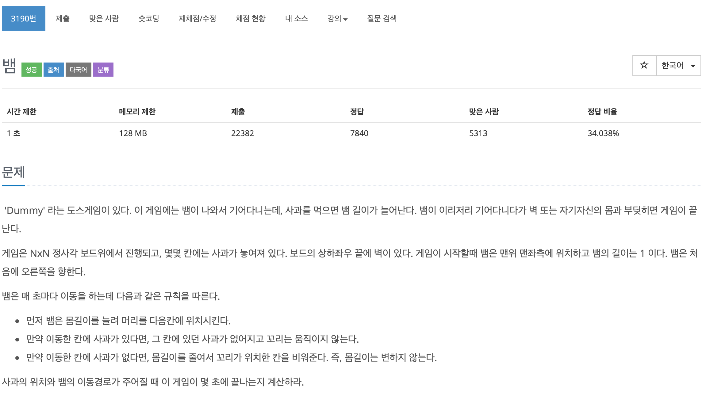
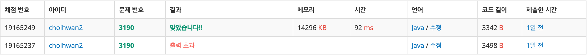

## 문제[#](https://www.acmicpc.net/problem/3190)



## 풀이 및 주저리..

역시나 저번에 이어서 시뮬레이션 문제였다. 정답비율이 너무 낮아서 시작전에 이걸 내가 과연 풀 수 있을까..? 라고 생각하면서 시작했었는데 신기하게 처음 시뮬레이션을 풀었던 로봇 청소기 문제보다 시간이 적게 걸리고 풀었던 것 같다. 시뮬레이션 문제에 조금씩 감이 잡히는 것 같기도하고.. 문제를 잘 이해하고 따라가는 실력이 늘어난 것 같기도 하다. 방향을 회전하거나 좌표를 구해서 움직이는 방법에 좀 친숙해진 느낌이라서 좋았다. 


풀면서 중점이 됐던 부분은 어떻게 뱀이 지나간 위치(몸)를 기억하는 것과 매초 시간이 지날때 규칙이 어떻게 진행 되는지 였던 것 같다. 지나간 위치는 java 에서 제공해주는 컬렉션 프레임워크 중 deque를 잘 활용해서 풀었던 것 같다. 시간 지날때마다 몸의 변화 규칙은 하나하나 천천히 생각해보면서 어떤 규칙이 먼저인지 따져보며 풀어보니 한 두번의 수정으로만으로 해결할 수 있었다.


규칙: 뱀의 몸길이를 늘려 머리를 다음칸에 위치시킨다.(가장 먼저 다음 위치가 벽인지 아니면 자신의 몸중에 한부분이라도 좌표값이 같은지 확인해본다.) => 벽이나 몸의 일부분이면 종료. 아니라면 사과의 유/무 확인 후 꼬리부분(deque.pollFirst()) 를 할지 말지를 결정. 시간이 지날때 마다 방향변경을 담고있는 맵이 key(시간) 값을 갖고 있는지 확인하며 진행.


## 코드

```java
package backjoon.algorthim.simulation;

import java.awt.Point;
import java.io.BufferedReader;
import java.io.IOException;
import java.io.InputStreamReader;
import java.util.Deque;
import java.util.HashMap;
import java.util.LinkedList;
import java.util.Map;

/*
 * 게임은 NxN 정사각 보드위에서 진행되고
 * 보드의 상하좌우 끝에 벽이 있다. 
 * 게임이 시작할때 뱀은 맨위 맨좌측에 위치하고 뱀의 길이는 1 이다. 
 * 뱀은 처음에 오른쪽을 향한다.
 * 
 * 뱀은 매 초마다 이동을 하는데 다음과 같은 규칙을 따른다.
 * 
 * 먼저 뱀은 몸길이를 늘려 머리를 다음칸에 위치시킨다.
 * 만약 이동한 칸에 사과가 있다면, 그 칸에 있던 사과가 없어지고 꼬리는 움직이지 않는다.
 * 만약 이동한 칸에 사과가 없다면, 몸길이를 줄여서 꼬리가 위치한 칸을 비워준다. 즉, 몸길이는 변하지 않는다.
사과의 위치와 뱀의 이동경로가 주어질 때 이 게임이 몇 초에 끝나는지 계산하라.
 * 
 * 첫째 줄에 보드의 크기 N이 주어진다. (2 ≤ N ≤ 100) 
 * 다음 줄에 사과의 개수 K가 주어진다. (0 ≤ K ≤ 100)
 * 
 * 다음 K개의 줄에는 사과의 위치가 주어지는데, 첫 번째 정수는 행, 
 * 두 번째 정수는 열 위치를 의미한다. 사과의 위치는 모두 다르며, 맨 위 맨 좌측 (1행 1열) 에는 사과가 없다.
 */
public class Problem3190 {
	static int N, K, L;
	static int[][] map;
	static int time = 0;
	static final int[][] DIR = { { 1, 0 }, { 0, 1 }, { -1, 0 }, { 0, -1 } };
	static boolean isGame = true;
	static Map<Integer, Character> dir_map = new HashMap<Integer, Character>();

	public static void main(String[] args) throws IOException {
		BufferedReader br = new BufferedReader(new InputStreamReader(System.in));
		N = Integer.parseInt(br.readLine());
		map = new int[N + 2][N + 2];
		K = Integer.parseInt(br.readLine());

		for (int i = 0; i < N + 2; i++) {
			map[0][i] = 1;
			map[N + 1][i] = 1;
			map[i][0] = 1;
			map[i][N + 1] = 1;
		} // 맵 제일 끝 부분 벽으로 만들기.

		for (int i = 0; i < K; i++) {
			String[] a_xy = br.readLine().split(" ");
			map[Integer.parseInt(a_xy[0])][Integer.parseInt(a_xy[1])] = 3;
		}

		

		L = Integer.parseInt(br.readLine());
		for (int i = 0; i < L; i++) {
			String[] arr_dir = br.readLine().split(" ");
			dir_map.put(Integer.parseInt(arr_dir[0]), arr_dir[1].toCharArray()[0]);
		}
		Snake snake = new Snake();
		while (isGame) {
			time++;
			snake.go();
			if (dir_map.containsKey(time)) {
				snake.changeDir(dir_map.get(time));
			}

		}
		System.out.println(time);
		
//		for (int i = 0; i < map.length; i++) {
//			for (int j = 0; j < map[i].length; j++) {
//				System.out.print(map[i][j]);
//			}
//			System.out.println();
//		} 맵 출력

	}

	static class Snake {
		Deque<Point> body = new LinkedList<Point>();
		int dir = 0;

		public Snake() {
			body.addLast(new Point(1, 1));
		}

		public void go() {
			int y = body.peekLast().y + DIR[dir][1];
			int x = body.peekLast().x + DIR[dir][0];


			for (Point pt : body) {
				if (pt.x == x && pt.y == y) {
					isGame = false;
				}
			}
			if (map[y][x] == 1) {
				isGame = false;
				return;
			} else if (map[y][x] == 0) {
				body.pollFirst();
			} else if (map[y][x] == 3) {
				map[y][x] = 0;
			}

			body.addLast(new Point(x, y));
		}

		public void changeDir(char c) {
			if (c == 'D') {
				dir = (dir + 1) % 4;
			} else if (c == 'L') {
				dir = dir - 1 >= 0 ? dir - 1 : 3;
			}
		}

	}
}

```




> 풀고나서 기록을 하루 넘긴다음 남기다보니 제출한 시간이 1일전이다.

## 기억에 남길 것!

- 언제나 시작점과 끝점은 중요하다.
- 문제를 잘 보고 클래스로 어떻게 만들면 좋을지 구상을 완벽하게 하고 접근하면 문제가 쉬워진다.
- 남들이 어렵다고 생각해도 나한테는 쉬운문제일 수도 쉽다고 생각해도 나한테는 어려운 문제일 수도 있다.
- java라는 언어가 가지고 있는 collection framework 를 잘쓴다면 정말 많은 도움이 된다.

