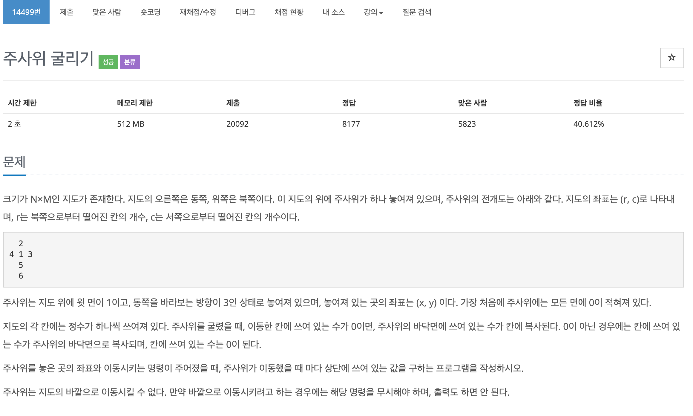

## 문제[#](https://www.acmicpc.net/problem/14499)



## 풀이 및 주저리..

저번에 로봇 청소기를 풀고 시뮬레이션 문제를 좀 더 풀어보고자 바로 도전한 주사위 굴리기 문제이다. 역시나 문제를 잘 읽고 이해를 제대로 하지 않고 시작하면 꽤나 헷갈리는 문제이다. 이렇게 한 두문제 풀다보니 이번에는 시간을 재면서 한시간 반~ 두시간 정도면 풀 수 있을거라 생각했는데.. 테스트케이스가 다 통과해도 실패가 뜨는 문제가 있었다. 코드를 제출하자마자 실패하는 걸로 보아 문제에서 뭔가 내가 놓친게 있다! 라고 계속해서 생각했지만 도통 찾기 힘들었다. 결국 학원에 남아서 조금 더 해도 발견하지 못했고 집에 돌아와 문제를 발견했다. 문제점은 바로.. 주사위의 위치가 r,c 에서 r이 y좌표고 c가 x 좌표였던 것.. 저번에도 이런 비슷한 문제로 시간을 꽤나 잡아먹었는데.. 이번에도 바뀌지 못하고 문제를 풀었던 내가 조금 답답했다:cry: 그래도 끝까지 답을 찾지 않고 집에와서 풀었을 때 기뻤으니 만족! 다음 문제도 아마 시뮬레이션을 풀텐데.. 그때는 정말 실수하지 말자.


풀고나서 코드량을 보니 이것저것 지저분한 것들도 있는 것 같고... 후에 한번 더 생각나면 깔끔하게 정리하는 법도 생각해보는게 좋을 것 같다. 문제를 풀고 찾아보니 주사위를 클래스로 만들어 생각하는 것도 나쁘지 않았을 것 같은데.. 나는 그냥 배열로 넣고 주석으로 값이 어떻게 변하는지 쓰면서 규칙을 찾아냈다. 심지어 이동하는 것도 한번씩만 훑고 마는 부분인데.. 큐로 만들어서 구현할 필요도 없었다. 

## 코드

```java
import java.io.BufferedReader;
import java.io.IOException;
import java.io.InputStreamReader;
import java.util.LinkedList;
import java.util.Queue;
import java.util.StringTokenizer;

/*
 * 지도의 좌표는 (r, c)로 나타내며, r는 북쪽으로부터 떨어진 칸의 개수, c는 서쪽으로부터 떨어진 칸의 개수
 * 주사위는 지도 위에 윗 면이 1이고, 동쪽을 바라보는 방향이 3인 상태로 놓여져 있으며, 놓여져 있는 곳의 좌표는 
 * (x, y) 이다. 가장 처음에 주사위에는 모든 면에 0이 적혀져 있다.
 * 			     { 뒤  왼   위   오   앞   밑}
 * 시작     => 밑면 6 { 2, 4, 1, 3, 5, 6}
 * 1(동) => 밑면 3 { 2, 6, 4, 1, 5, 3} (1 -> 2) (2 -> 3) (3 -> 5) (5 -> 1)
 * 2(서) => 밑면 4 { 2, 1, 3, 6, 5, 4} (5 -> 3) (3 -> 2) (2 -> 1) (1 -> 5)
 * 3(북) => 밑면 2 { 1, 4, 5, 3, 6, 2} (0 -> 5) (5 -> 4) (5 -> 2) (2 -> 0) 
 * 4(남) => 밑면 5 { 0, 0, 0, 0, 0, 0} (4 -> 5) (5 -> 0) (0 -> 2) (2 -> 5)
 * 
 * 시작 => 밑면 5
 * 1 => 밑면 3
 * 지도의 각 칸에는 정수가 하나씩 쓰여져 있다. 주사위를 굴렸을 때, 이동한 칸에 쓰여 있는 수가 0이면, 
 * 주사위의 바닥면에 쓰여 있는 수가 칸에 복사된다. 0이 아닌 경우에는 칸에 쓰여 있는 수가 주사위의 바닥면으로 복사되며, 
 * 칸에 쓰여 있는 수는 0이 된다.
 * 
 * 주사위를 놓은 곳의 좌표와 이동시키는 명령이 주어졌을 때, 
 * 주사위가 이동했을 때 마다 상단에 쓰여 있는 값을 구하는 프로그램을 작성하시오.
 * 
 * 마지막 줄에는 이동하는 명령이 순서대로 주어진다. 동쪽은 1, 서쪽은 2, 북쪽은 3, 남쪽은 4로 주어진다.
 */
public class Problem14499 {
	static int height, width, x, y, K;

	static int[][] map;

	static int[] dice = { 0, 0, 0, 0, 0, 0 };

	static final int[][] DIR = { { 0, 0 }, { 1, 0 }, { -1, 0 }, { 0, -1 }, { 0, 1 } };

	public static void main(String[] args) throws IOException {
		BufferedReader br = new BufferedReader(new InputStreamReader(System.in));
		String[] in = br.readLine().split(" ");
		height = Integer.parseInt(in[0]);
		width = Integer.parseInt(in[1]);

		Queue<Integer> work_q = new LinkedList<Integer>();

      
		y = Integer.parseInt(in[2]);
		x = Integer.parseInt(in[3]);
		K = Integer.parseInt(in[4]);

		map = new int[height][width];
		for (int i = 0; i < height; i++) {
			String[] m_line = br.readLine().split(" ");
			for (int j = 0; j < m_line.length; j++) {
				map[i][j] = Integer.parseInt(m_line[j]);
			}
		}

		StringTokenizer stk = new StringTokenizer(br.readLine());
		while (stk.hasMoreTokens()) {
			work_q.add(Integer.parseInt(stk.nextToken()));
		}

		while (!work_q.isEmpty()) {
			int dir = work_q.poll();
			boolean isIn = inMap(dir);
			if (isIn) {
				move(dir);
				getMap();
				System.out.println(dice[2]);
			}
		}
	}
//	 * 시작     => 밑면 6 { 2, 4, 1, 3, 5, 6}
//	 * 1(동) => 밑면 3 { 2, 6, 4, 1, 5, 3} (1 -> 2) (2 -> 3) (3 -> 5) (5 -> 1)
//	 * 2(서) => 밑면 4 { 2, 1, 3, 6, 5, 4} (5 -> 3) (3 -> 2) (2 -> 1) (1 -> 5)
//	 * 3(북) => 밑면 2 { 1, 4, 5, 3, 6, 2} (0 -> 5) (5 -> 4) (4 -> 2) (2 -> 0) 
//	 * 4(남) => 밑면 5 { 0, 0, 0, 0, 0, 0} (4 -> 5) (5 -> 0) (0 -> 2) (2 -> 5)

	public static void move(int dir) {

		int[] temp_dice = new int[6];
		switch (dir) {
		case 1:
			temp_dice[0] = dice[0];
			temp_dice[1] = dice[5];
			temp_dice[2] = dice[1];
			temp_dice[3] = dice[2];
			temp_dice[4] = dice[4];
			temp_dice[5] = dice[3];
			break;
		case 2:
			temp_dice[0] = dice[0];
			temp_dice[1] = dice[2];
			temp_dice[2] = dice[3];
			temp_dice[3] = dice[5];
			temp_dice[4] = dice[4];
			temp_dice[5] = dice[1];
			break;
		case 3:
			temp_dice[0] = dice[2];
			temp_dice[1] = dice[1];
			temp_dice[2] = dice[4];
			temp_dice[3] = dice[3];
			temp_dice[4] = dice[5];
			temp_dice[5] = dice[0];
			break;
		case 4:
			temp_dice[0] = dice[5];
			temp_dice[1] = dice[1];
			temp_dice[2] = dice[0];
			temp_dice[3] = dice[3];
			temp_dice[4] = dice[2];
			temp_dice[5] = dice[4];
			break;
		default:
			break;
		}
		dice = temp_dice;
	}

	public static boolean inMap(int dir) {
		boolean isIn = true;
		int x_m = x + DIR[dir][0];
		int y_m = y + DIR[dir][1];
		if (x_m >= 0 && x_m < width) {
			x = x_m;
		} else {
			return false;
		}
		if (y_m >= 0 && y_m < height) {
			y = y_m;
		} else {
			return false;
		}
		return isIn;
	}

	public static void getMap() {
		if (map[y][x] == 0) {
			map[y][x] = dice[5];
		} else {
			dice[5] = map[y][x];
			map[y][x] = 0;
		}
	}
}

```


> 학원에서 풀다가 결국 해결 못하고 집에와서 밥먹고 다시 보자마자.. 틀린부분을 확인하고 고쳐서 제출하였다.

## 기억에 남길 것!

- 문제를 읽으면서 놓치는 부분이 없도록 하자. 테스트 케이스를 통과하고 문제의 답을 확인할 수 있다면 좋겠지만 실전에서는 그럴수 없다. 놓치는 순간 끝인걸 명심하자.
- 머리로 따라가는게 너무 힘들면 클래스로 만드는 것도 나쁘지 않다.