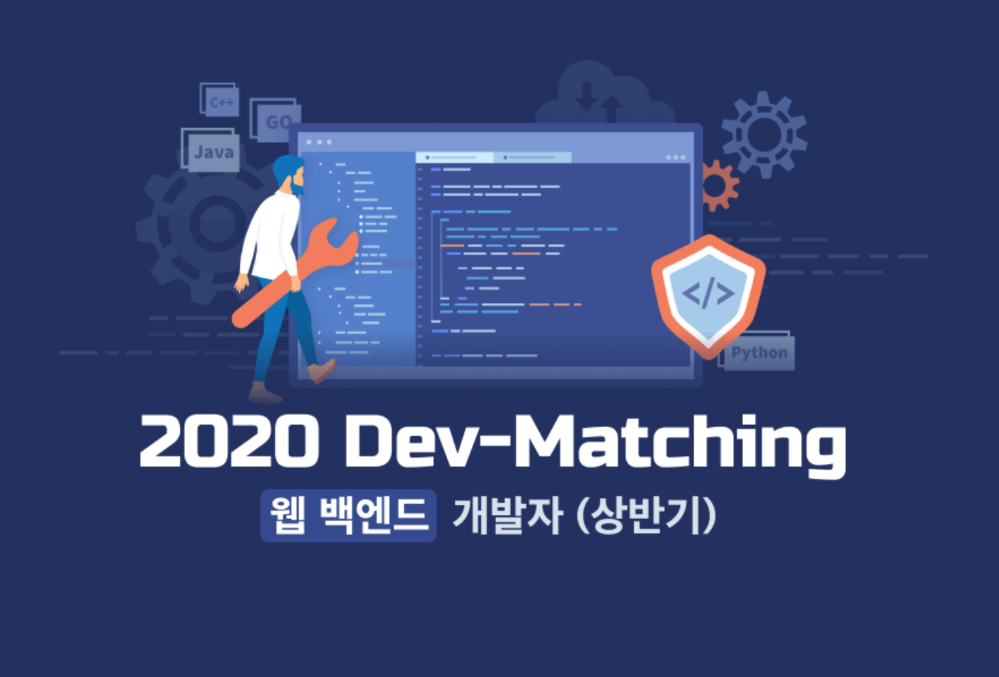

이번 18일에 프로그래머스에서 주관하는 웹 백엔드 개발자 Dev-Mathching을 지원하여 코딩테스트를 보게 되었다. 이번 Dev-Matching 에서는 따로 과제가 없고 코딩테스트로만으로 추후 선택한 기업과 연결해주는 좋은 제도(?) 였다. 상반기 웹 프론트같은 경우 시험을 보지는 않았지만 구글링해본 결과 난이도가 상당히 있어보였고.. 그래서 SQL 문제를 포함한 알고리즘 문제가 상당히 어려울 것이라 예상하고.. 시험을 시작했다. 

하지만..? 결과적으로는 지금까지 봤던 코딩테스트 중에서 개인적으로 가장 난이도가 낮았던 것 같다. 알고리즘 3문제, SQL 1문제였는데 SQL 문제는 `join` 을 활용한 문제로 쉽게 풀 수 있었고 (SQL문제는 대부분 난이도가 높아봐야 거기서 거기인것 같기도..?) 알고리즘 1번은 그리디, 2번은 시뮬레이션으로 쉽게 풀어 나갈 수 있었다. 특히 2번 같은 경우는 최근에 포스팅한 로봇청소기와 뱀 문제 보다 쉬운 형태로 나와 최근 공부가 정말 크게 도움이 되었던 것 같다. 처음 접했으면 정말 어렵게 느껴졌겠지만 최근 시뮬레이션만 풀다보니.. 특히 SW 역량평가의 문제를 읽으면서 문제 이해력이 좀 높아진것 같기도 한것 같다. 그리고 3번.. 문제는  비교적 짧고 간단해보였지만 결국 끝까지 풀지 못했다. 그 이유는 아직 내가 많이 준비하지 못한 DFS 부분이였기 때문.. 문제를 보고 많이 풀어보지 못한 DFS/BFS 부분인 것 같은데 머리가 로직을 따라갈 수가 없었다. 한시간 동안 3문제를 풀고 1시간이란 시간이 남아서 열심히 도전해보았지만.. 결국 문제를 풀지 못했고 아직 많이 부족했다는 것을 알게 되었다. 

조금 더 잘 준비했다면 네 문제를 다 풀수도 있었을 것 같은 시험이였는데.. 정말 아쉬움이 많이 남았고 처음에 알고리즘을 시작하면서 '내가 과연 코딩테스트에서 문제를 다 풀 수 있을까?' 라고 생각했던 날이 다가올뻔 했다. 다음 코딩테스트는 아마  1차 코딩테스트를 합격한 SW마에스트로 2차 코딩테스트가 될 것 같은데... 일주일 정도 남은 기간이다. 이때동안 DFS 와 BFS 를 개념적으로 더 확실하게 익히고 간단한 문제라도 조금은 손댈수 있는 정도가 된 상태로 시험을 봤으면 좋을 것 같은 생각이 들었다. 