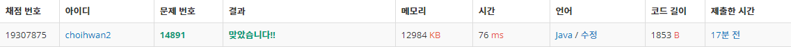

## 문제[#](https://www.acmicpc.net/problem/14891)

너무 길어서 링크에 들어가서 보는걸로 대체..

## 풀이 및 주저리..

저번주에 이어서 백준의 다음 시뮬레이션 문제이다. 정답률은 최근에 풀었던 시뮬레이션 문제보다 높은 54%라서 쉽게 생각하고 접근했다. 조금 어려웠던 부분은 톱니바퀴 하나가 회전을 하기전에 옆의 톱니바퀴를 확인하여 그것을 돌릴지 말지 먼저 결정한 (살짝 DFS 와 비슷한 것 같기도..?) 다음 자신을 회전해야하는데 이 순서가 바뀌거나 자칫 잘못생각하면 무한루프에 빠질 수도 있을 것 같았다. 하지만 좌 우 살피는 `r_check` 와 `l_check` 메소드를 만들고 그 이후 회전하는 `rot_wheel` 메소드로 톱니바퀴를 회전시켰다. 나름 깔끔하게 짰다고 처음에 생각했지만.. 역시나 고난은 있었다.


테스트 케이스조차 지나가지지 않아서 어디가 문제인지를 파악하는게 좀 오래 걸렸던 것 같다. 당연히 좌우 확인하는 로직에서 문제가 있을거라고 생각해 그쪽 부분을 중점적으로 봤는데 문제는 다른곳인 `rot_wheel` 이 였다. `rot_wheel` 안의 `for`문에서 배열의 값을 오른쪽 왼쪽으로 shift 하는 과정에서 실수로 하나의 값이 계속 옮겨가지게 구현을 한 것이였다. 전처럼 문제에서 놓친부분이 있을거라고 생각하면서 문제를 정말 꼼꼼히 읽고 다시 접근하고 그랬는데.. 언제나 문제는 쉬운곳에 있는 것 같다. 


## 코드

```java
package backjoon.algorthim.simulation;

import java.io.BufferedReader;
import java.io.IOException;
import java.io.InputStreamReader;

public class Problem14891 {
	static char[][] wheel = new char[4][8];
	static int rot_case_num;
	static int[][] rot_case;

	public static void main(String[] args) throws IOException {
		int answer = 0;
		BufferedReader br = new BufferedReader(new InputStreamReader(System.in));
		for (int i = 0; i < 4; i++) {
			wheel[i] = br.readLine().toCharArray();
		}
		rot_case_num = Integer.parseInt(br.readLine());
		rot_case = new int[rot_case_num][2];
		for (int i = 0; i < rot_case_num; i++) {
			String[] input = br.readLine().split(" ");
			rot_case[i][0] = Integer.parseInt(input[0]) - 1;
			rot_case[i][1] = Integer.parseInt(input[1]);
		}
		for (int i = 0; i < rot_case_num; i++) {
			compare_wheel(rot_case[i][0], rot_case[i][1]);
		}
		for (int i = 0; i < wheel.length; i++) {
			answer += Character.getNumericValue(wheel[i][0]) * (int) Math.pow(2, i);
		}
		System.out.println(answer);

	}

	public static void compare_wheel(int pos, int dir) {
		l_check(pos, dir);
		r_check(pos, dir);
		rot_wheel(pos, dir);
	}

	public static void l_check(int pos, int dir) {
		if (pos == 0)
			return;
		if (wheel[pos][6] != wheel[pos - 1][2]) {
			l_check(pos - 1, dir * -1);
			rot_wheel(pos - 1, dir * -1);
		}
	}

	public static void r_check(int pos, int dir) {
		if (pos == 3)
			return;
		if (wheel[pos][2] != wheel[pos + 1][6]) {
			r_check(pos + 1, dir * -1);
			rot_wheel(pos + 1, dir * -1);
		}
	}

	public static void rot_wheel(int pos, int dir) {

		if (dir == 1) {
			char temp = wheel[pos][7];
			for (int i = 7; i > 0; i--) {
				wheel[pos][i] = wheel[pos][i - 1];
			}
			wheel[pos][0] = temp;
		} else if (dir == -1) {
			char temp = wheel[pos][0];
			for (int i = 0; i < 7; i++) {
				wheel[pos][i] = wheel[pos][i + 1];
			}
			wheel[pos][7] = temp;
		}

	}
}

```





## 기억에 남길 것!

- String.trim() 은 문자열이 시작되기 전과 후의 공백만 없애준다. 문자열 사이의 공백을 없애주려면 String.replace(" ", "")을 이용하자
- 복잡해보여도 문제를 좀 더 차분히 읽고 풀 수 있다는 생각으로 접근하자!