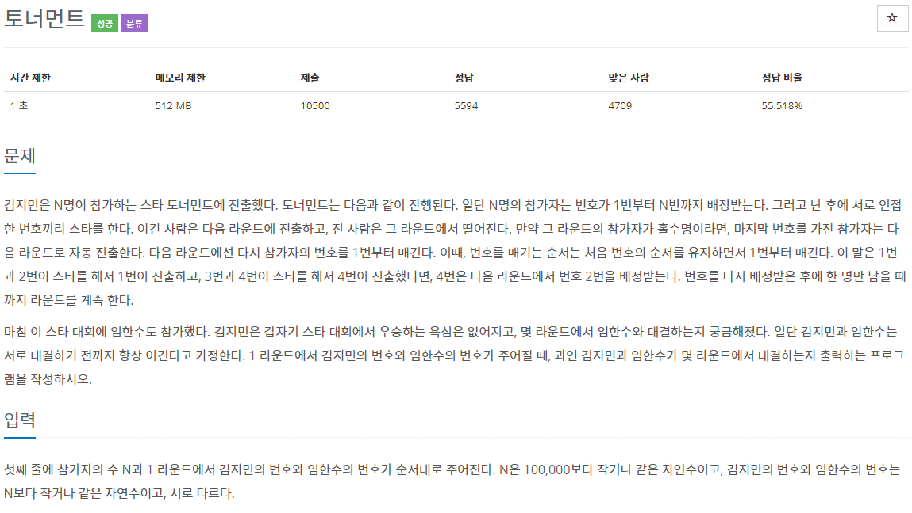

## 문제[#](https://www.acmicpc.net/problem/1057)



## 풀이 및 주저리..

저번 문제를 풀고 이번주 SW마에스트로 코딩테스트를 대비한다는 생각으로 이어서 바로 풀어봤던 문제였다. 문제내용은 길지만 결국 지민이와 한수가 언제 대결을 하는지 찾는 문제였다. 처음에 단순하게 시뮬레이션으로 배열을 만들고 차례로 줄여나갈까 생각도 했었는데 배열의 크기를 계속 줄이면서 새로만드는 것 자체가 너무 비효율적이라고 생각했다. 결국 지민이와 한수는 **무조건 이긴다** 라는 조건을 잘 생각해봤고 둘이 만나지 않을 경우 -1을 출력하라는 말을 잘 생각해봤다. 토너먼트에서 계속 이기는데 둘이 만나지 않는 경우는 없다고 생각했고 다른 예외로 부전승을 고민하면서 어떻게 구현을 해야하나 고민을 하고 있었다. 그러다 뭔가 수리적인 접근으로 분명 규칙이 있을 것 같다고 생각했다.

만약 1 과 2 중 지민이나 한수가 있으면 12 는 후에 1이되는거고 34 는 2 가 되고... 결국 (지금의 번호 +1) /2 가 다음번의 자신의 번호가 된다고 결론이 나왔다. 그래서 그 둘의 번호가 같아지는 순간? => 지민이와 한수가 만나는 순간. 이라고 생각을 해서 코드를 작성해 보았다. 이게 정답이였지만..

막상 시험에서 이 문제를 만났다고 생각하고 테스트케이스는 넘어갈 수 있지만 정말로 이게 정답인가? 라는 확신이 부족했다. 근래에 봤던 라인, 소마 코테에서 제출을 하더라도 그게 정확한 정답인지 아닌지 확인할 수 없었기 떄문이다. 즉, 테스트케이스가 잘 통과된다고 문제를 넘어가는 순간.. 그 문제를 다시 보지 않게되고 반례가 존재할 경우 문제를 틀리던 경우가 있었다.(라인 1번을..) 생각해보면 소마 1차 온라인 코딩테스트를 통과한 것도 1번을 확실하게 풀었기 때문인 것 같다. 하여튼.. 로직을 짜고 생각을 해보며 반례를 찾았는데 부전승의 위치에 지민이나 한수가 간다면 이상한 정답이 나올거라고 생각했다. 거의 한시간 정도 문제를 고민했고 결국 답에 확신이 없이 제출을 하게 되었다. 다행이 정답이긴 했지만.. 이걸 과연 풀었다고 할 수 있는건지.. 결국 계속 생각하다보니 내가 푼 방식은 부전승에 영향을 받지 않고 수를 줄여나가며 비교하니 반례가 존재하지 않는 것이 였다. 실제 시험에서도 이렇게 맞아서 넘어가게 되면 다행이지만.. 틀릴경우 끝이니 이런 방식이 도움이 될 것 같다. 물론 시간을 좀 많이 쓰는건 좋지 않겠지만..


## 코드

```java
package backjoon.algorthim.simulation;

import java.io.BufferedReader;
import java.io.IOException;
import java.io.InputStreamReader;

public class Problem1057 {
	static int N, kim, yim;

	public static void main(String[] args) throws IOException {
		BufferedReader br = new BufferedReader(new InputStreamReader(System.in));
		String[] input = br.readLine().split(" ");
		int answer = 0;
		N = Integer.parseInt(input[0]);
		kim = Integer.parseInt(input[1]);
		yim = Integer.parseInt(input[2]);
		while (kim != yim) {
			kim = (kim + 1) / 2;
			yim = (yim + 1) / 2;
			answer++;
		}
		System.out.println(answer);
	}
}
```


## 기억에 남길 것!

- 문제의 정답을 확인할 때는 언제나 확신에 찬 상태로 제출하도록 하자.
- 실제 시험에서는 시간과 정확도에 잘 비중을 맞춰서 문제를 풀어야할 것 같다.