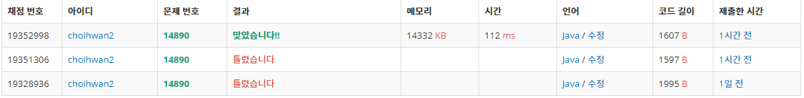

## 문제[#](https://www.acmicpc.net/problem/14890)

>  문제가 너무 길어서 링크로 대체..


## 풀이 및 주저리..

풀었던 시뮬레이션 문제중에서 가장 시간이 오래 걸리면서 푼 문제가 되었다. 처음에 시간을 재면서 풀다보니 좀 급급해지는 마음으로 접근하다가 중복되는 코드와.. 알아볼 수 없는 형식 등등 너무 심각한 문제들이 많이 발생해서 적어두고 가끔 와서 보면서 반성하는 의미로 코드를 두개 올린다.

풀이는 길을 배열로 받아 가면서 자신보다 1 높은 곳을 발견할 때와 1 낮은 곳을 발견할 때 어떤 로직으로 처리하느냐가 관건이였던 문제였다. 높은 경우는 쉽게 해결할 수 있었지만 낮은 곳으로 내려갈 때가 좀 어려웠던 것 같다. 구글링해보니 진행을 잠시 멈추고 하는 경우도 있었는데 내가 푼 경우는 계속 진행을 하면서 갈수 있는지를 체크하는 살짝 무식한 방법이였던것 같다.

처음에 한시간 반이라는 시간이 걸려서 문제를 풀고  테스트케이스도 다 통과했지만 문제 자체가 정답이 나오지 않았다. 분명 놓친 반례가 있을거라고 생각했고 계속해서 고민하다보니 시간이 너무나도 많이 흘러가버렸다. 코드가 정말 너무너무 마음에 들지않아서 하루지나서 다시 처음부터 문제를 읽고 좀 더 정리하면서 풀어본 코드가 두번째 코드이다. 하지만 끝까지 반례를 찾지 못했고 백준의 질문검색으로 사람들이 올려놓은 질문들과 좀더 추가한 테스트 케이스들을 넣어가며 반레를 찾아낼 수 있었다. 2일에 걸쳐서 같은 문제를 풀면서 좌절감도 좀 많이 느껴졌지만 결국 풀어냈다.


## 코드

- 처음 작성한 코드.. 매우 지저분하고 생각없이 접근하면서 풀지 못했다.

<details> 
    <summary>접기/펼치기</summary>

```java
package backjoon.algorithm.simulation;

import java.io.BufferedReader;
import java.io.IOException;
import java.io.InputStreamReader;

public class Problem14890 {
	static int N, L;
	static char[][] map;

	public static void main(String[] args) throws IOException {
		BufferedReader br = new BufferedReader(new InputStreamReader(System.in));
		String[] sizeStr = br.readLine().split(" ");
		N = Integer.parseInt(sizeStr[0]);
		L = Integer.parseInt(sizeStr[1]);
		int answer = 0;
		map = new char[N][N];
		for (int i = 0; i < N; i++) {
			map[i] = br.readLine().replace(" ", "").toCharArray();
		}

		for (int i = 0; i < N; i++) {
			char height = map[i][0];
			int height_num = 1;
			int temp_L = L;
			boolean isCan = true;
			for (int j = 1; j < N; j++) {
				if (height == map[i][j]) {
					height_num++;
				} else if (height + 1 == map[i][j] && temp_L == L) {
					if (height_num >= L) {
						height = map[i][j];
						height_num = 1;
						continue;
					} else {
						isCan = false;
						break;
					}
				} else if (height - 1 == map[i][j]) {
					if (--temp_L != 0) {
						isCan = false;
					} else {
						height = map[i][j];
						temp_L = L;
						height_num = 0;
						isCan = true;
					}
				} else {
					isCan = false;
					break;
				}
			}
			if (isCan) {
				answer++;
			}
		}

		for (int i = 0; i < N; i++) {
			char height = map[0][i];
			int height_num = 1;
			int temp_L = L;
			boolean isCan = true;
			for (int j = 1; j < N; j++) {
				if (height == map[j][i]) {
					height_num++;
				} else if (height + 1 == map[j][i] && temp_L == L) {
					if (height_num >= L) {
						height = map[j][i];
						height_num = 1;
						continue;
					} else {
						isCan = false;
						break;
					}
				} else if (height - 1 == map[j][i]) {
					if (--temp_L != 0) {
						isCan = false;
					} else {
						height = map[j][i];
						height_num = 0;
						temp_L = L;
						isCan = true;
					}
				} else {
					isCan = false;
					break;
				}
			}
			if (isCan) {
				answer++;
			}
		}

		System.out.println(answer);
	}
}
```
</details>


- 2차 코드

```java
package backjoon.algorithm.simulation;

import java.io.BufferedReader;
import java.io.IOException;
import java.io.InputStreamReader;

import java.io.BufferedReader;
import java.io.IOException;
import java.io.InputStreamReader;

public class Problem14890_2 {
	static int N, L;
	static int[][] map;

	public static void main(String[] args) throws IOException {
		int sum = 0;
		BufferedReader br = new BufferedReader(new InputStreamReader(System.in));
		String[] input = br.readLine().split(" ");
		N = Integer.parseInt(input[0]);
		L = Integer.parseInt(input[1]);
		map = new int[N][N];
		for (int i = 0; i < N; i++) {
			String[] values = br.readLine().split(" ");
			for (int j = 0; j < N; j++) {
				map[i][j] = Integer.parseInt(values[j]);
			}
		}

		for (int i = 0; i < N; i++) {
			sum += check(i, 0, 1) ? 1 : 0;
			sum += check(0, i, 0) ? 1 : 0;
		}
		System.out.println(sum);

	}

	public static boolean check(int x, int y, int dir) {
		boolean answer = true;
		int[] heights = new int[N];
		if (dir == 0) {
			for (int i = 0; i < N; i++) {
				heights[i] = map[y][i];
			}
		} else if (dir == 1) {
			for (int i = 0; i < N; i++) {
				heights[i] = map[i][x];
			}
		}

		int now = heights[0];
		int heights_n = 1;
		int down = L;

		for (int i = 1; i < N; i++) {
			if (now == heights[i] && answer) {
				heights_n++;
			} else if (now + 1 == heights[i] && answer) {
				if (heights_n >= L) {
					now = heights[i];
					heights_n = 1;
					continue;
				} else {
					return false;
				}
			} else if (now - 1 == heights[i]) {
				down--;
				if (down == 0) {
					now = heights[i];
					heights_n = 0;
					down = L;
					answer = true;
				} else {
					answer = false;
				}
			} else {
				return false;
			}
		}

		return answer;
	}

}
```




## 기억에 남길 것!

- 문제를 풀때 충분하게 고민하고 머리속으로 설계가 끝나면 문제를 풀도록 하자. 시간에 쫓겨 풀다보면 더 문제가 심각해진다.
