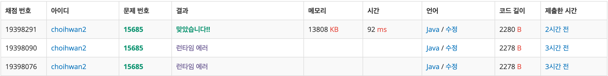

## 문제[#](https://www.acmicpc.net/problem/15685)

>  문제가 너무 길어서 링크로 대체..


## 풀이 및 주저리..

다른 시뮬레이션 문제와 같이 문제를 이해하고 코드로 어떻게 구현하냐가 중요했던 문제였다. 중요했던 부분으로는 드래곤 커브가 어떤 규칙을 가지고 진행 되는지 알아내는 것! 문제에서 **즉, K(K > 1)세대 드래곤 커브는 K-1세대 드래곤 커브를 끝 점을 기준으로 90도 시계 방향 회전 시킨 다음, 그것을 끝 점에 붙인 것이다.** 이 부분을 해석하는것이 가장 중요했던것 같다. 끝 점에서 부터 붙인다는 개념을 이미 가지고 있는 리스트에서 마지막의 간선의 상태로 다음에 어떻게 이어질지를 구해낼 수 있었다. 그래서 커브를 클래스 빼고 모든 점을 가지고 있는 `body` 리스트와 지금까지 진행하면서 간선들이 가지고 있는 방향의 정보를 `s_dir` 에 저장해 그다음의 드래곤 커브를 구하게 되었다. 

문제를 풀고나서 생각하다보니 굳이 `body`라는 리스트로 `Point`의 정보를 가질 필요가 없다는 것을 알게 되었고 조금 쓸데없는 부분들이 포함되었지만 나름 깔끔하게 문제를 풀은것 같아 기분이 좋았다.

## 코드

```java
package backjoon.algorithm.simulation;

import java.awt.Point;
import java.io.BufferedReader;
import java.io.IOException;
import java.io.InputStreamReader;
import java.util.LinkedList;
import java.util.Stack;


public class Problem15685 {
	/*
	 * 오른쪽 시작일때
	 * 
	 * x +1 => y -1 y -1 => x -1 x -1 => y +1 y +1 => x +1
	 * 
	 * 0: x좌표가 증가하는 방향 (→) 1: y좌표가 감소하는 방향 (↑) 2: x좌표가 감소하는 방향 (←) 3: y좌표가 증가하는 방향
	 * (↓)
	 */
	static final int[][] DIR = { { 1, 0 }, { 0, -1 }, { -1, 0 }, { 0, 1 } };
	static int[][] map = new int[101][101];

	public static void main(String[] args) throws IOException {
		BufferedReader br = new BufferedReader(new InputStreamReader(System.in));
		int curv_n = Integer.parseInt(br.readLine());
		for (int i = 0; i < curv_n; i++) {
			String[] curv = br.readLine().split(" ");
			int x = Integer.parseInt(curv[0]);
			int y = Integer.parseInt(curv[1]);
			int dir = Integer.parseInt(curv[2]);
			int gen = Integer.parseInt(curv[3]);
			DragonCurve dCurve = new DragonCurve(x, y, dir);
			dCurve.nextGeneration(gen);
			dCurve.checkArea();
		}
		int answer = checkDrangonCurve();
		System.out.println(answer);
	}

	static class DragonCurve {
		int x;
		int y;
		LinkedList<Point> body = new LinkedList<Point>();
		Stack<Integer> s_dir = new Stack<Integer>();

		public DragonCurve(int x, int y, int dir) {
			this.x = x;
			this.y = y;
			body.add(new Point(x, y));
			body.add(go(dir));
			s_dir.push(dir);
		}

		public void nextGeneration(int gen) {
			for (int i = 0; i < gen; i++) {
				Stack<Integer> temp_s = new Stack<Integer>();
				temp_s.addAll(s_dir);
				while (!temp_s.isEmpty()) {
					int dir = temp_s.pop();
					dir = dir + 1 < 4 ? dir + 1 : 0;
					body.add(go(dir));
					s_dir.push(dir);
				}
			}
		}

		public Point go(int dir) {
			x += DIR[dir][0];
			y += DIR[dir][1];
			return new Point(x, y);
		}

		public void checkArea() {
			for (Point pt : body) {
				map[pt.y][pt.x] = 1;
			}
		}
	}

	public static int checkDrangonCurve() {
		int answer = 0;
		for (int i = 0; i < 100; i++) {
			for (int j = 0; j < 100; j++) {
				if (map[i][j] == 1 && map[i][j + 1] == 1) {
					if (map[i + 1][j] == 1 && map[i + 1][j + 1] == 1) {
						answer++;
					}
				}
			}
		}
		return answer;
	}
}
```


### 채점결과




## 기억에 남길 것!

- 문제에서 클래스 빼서 정의할 수 있는 부분은 빼서 생각하면 문제가 쉬워진다.
