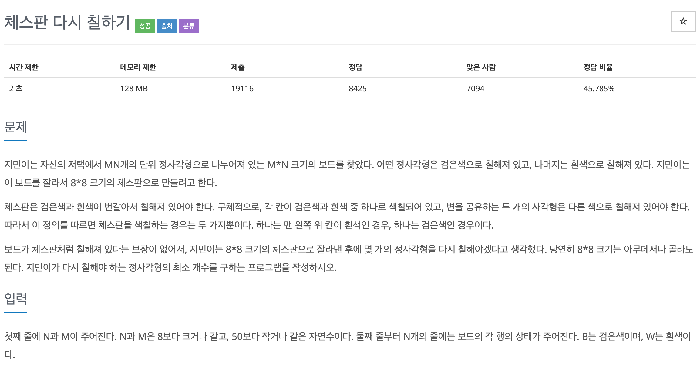
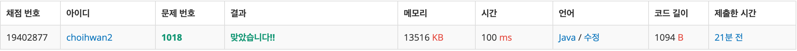

## 문제[#](https://www.acmicpc.net/problem/1018)



## 풀이 및 주저리..

과거에 풀어보려다가 실패했던 문제였다. 그때 실패했던 문제는 정답을 확인한후 구현을 해보기도하고 시간을 조금 갖고 다시 도전한다. 그때 당시에 처음으로 알고리즘을 시작하던 때라 그저 막막한 생각에 못풀었던 문제였지만 지금 다시 와서 보니 다른 문제보다 더 쉬운 느낌을 받았다. 

먼저 길이가 8인 비교할 한줄 체스판을 만들어놓고 생각하니 문제가 쉬워졌던것 같다. 메소드로 8X8의 체스판을 시작점과 끝점 그리고 한줄 체스판중 어떤 것을 사용할지를 받아와 문제를 해결하였다.

## 코드

```java
package backjoon.algorithm.simulation;

import java.io.BufferedReader;
import java.io.IOException;
import java.io.InputStreamReader;

public class Problem1018 {

	static final String[] BASIC = { "WBWBWBWB", "BWBWBWBW" };
	static char[][] board;

	public static void main(String[] args) throws IOException {
		BufferedReader br = new BufferedReader(new InputStreamReader(System.in));
		String[] xy = br.readLine().split(" ");
		int height = Integer.parseInt(xy[0]);
		int width = Integer.parseInt(xy[1]);

		int min = 65;

		board = new char[height][width];

		for (int i = 0; i < height; i++) {
			board[i] = br.readLine().toCharArray();
		}

		for (int i = 0; i <= height - 8; i++) {
			for (int j = 0; j <= width - 8; j++) {
				min = Math.min(min, Math.min(compareBoard(j, i, 0), compareBoard(j, i, 1)));
			}
		}
		System.out.println(min);
	}

	public static int compareBoard(int x, int y, int start) {
		int answer = 0;
		for (int i = 0; i < 8; i++) {
			for (int j = 0; j < 8; j++) {
				if (board[y + i][x + j] != BASIC[start].charAt(j)) {
					answer++;
				}
			}
			start = start + 1 < 2 ? start + 1 : 0;
		}
		return answer;
	}
}
```

### 채점결과




## 기억에 남길 것!

- 비교할 대상을 정의하고 머리속으로 어떤 메소드를 사용할지 분리하고 접근하면 문제가 쉬워진다.

