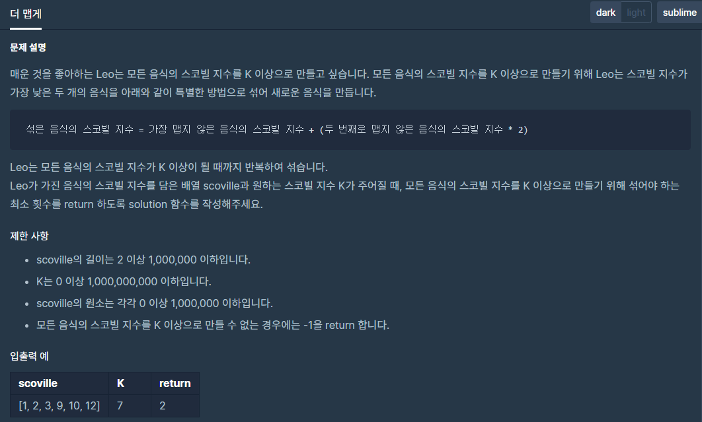

## 문제[#](https://programmers.co.kr/learn/courses/30/lessons/42626)



## 풀이 및 주저리..

전 문제에 이어서 한번도 보지 않았던 프로그래머스의 힙 문제의 lvl2 문제인 더 맵게! 이다. 우선순위 큐를 활용하면 간단하게 풀 수 있는 문제였지만, 아직 알고리즘 초보인 난.. 우선순위 큐라는 개념은 알고있었지만 그게 자바 라이브러리로 제공되는지도 모르고.. 열심히 문제를 풀어보았다. 기본적인 연결리스트와 스택을 활용해서 풀어보려고 했지만.. 정확도는 맞게 나오더라도 효율성이 극악이라.. 절대 통과할 수 없는 문제였다.

결국 구글링한 결과 우선순위 큐를 어떻게 만드는 지, 그리고 자바 자체에서 제공되는 `PriorityQueue` 클래스를 활용해서 쉽게 문제를 풀 수 있었다. 라이브러리 공부를 좀 더 해야할 것 같다.


## 코드

```java
package programmers.heap;

import java.util.PriorityQueue;

public class Hotter {
	public int solution(int[] scoville, int K) {
		int answer = 0;
		PriorityQueue<Integer> list = new PriorityQueue<Integer>();
		for (int i = 0; i < scoville.length; i++) {
			list.offer(scoville[i]);
		}
		while (list.peek() < K) {
			if (list.size() >= 2) {
				int min = list.poll();
				int min2 = list.poll();

				int hotter = min + (min2 * 2);
				list.offer(hotter);
				answer++;
			}else {
				return -1;
			}
		}
		return answer;
	}
}

```

## 기억에 남길 것!

- [우선 순위 큐 활용법](https://cjh5414.github.io/priorityqueue/)
- 자바에서 제공되는 Collection 들을 활용하자 (개념부터 알고..)

