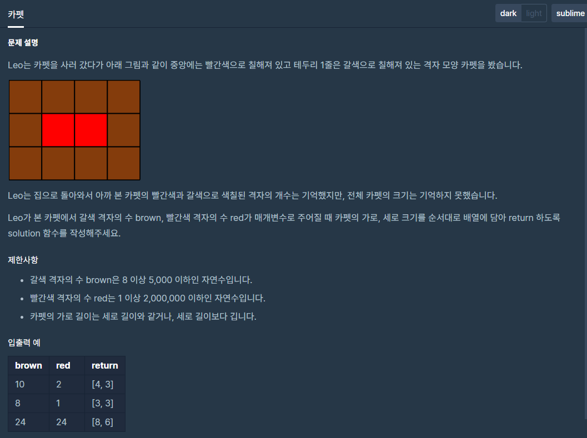

## 문제[#](https://programmers.co.kr/learn/courses/30/lessons/42842)



## 풀이 및 주저리..

소프트웨어 마에스트로 코테 이후, 다양한 분양의 알고리즘을 풀어보고자 프로그래머스에 있는 완전 탐색 문제인 카펫을 풀어보았다. lvl2 단계로 30분안에 푸는 것을 목표로 하였는데, 정확하게 35분 걸려서 문제를 풀었다. 차차 줄여나가보자

문제는 갈색과 빨간색 그리고 `return` 해주는 배열의 값들을 보다가 어떻게 탐색하면 될지 생각해 보았다. 결국 빨간 카펫  개수 + 갈색 카펫의 개수 = return 배열값의 곱인것 부터 생각해나갔다. 그리고 빨간 카펫의 개수를 만드는 약수중의 두개 (ex : 2 => 1,2 / 24 => 1,24 2,12 3,8 4,6) 가로, 세로 의 개수 양쪽에 +2 를 해줘 테두리(갈색)를 만드는 직사각형이 총 개수라는 것을 알게되었다. 그후 구현은 쉽게 끝났다.

뭔가 좀더 빠르게 할 수 있는 방법이 있을 것 같기도 하고.. 살짝 아쉽게 푼 문제였다.

## 코드

```java
package programmers.perfectsearch;

import java.util.Arrays;

public class Carpet {
	/*
	 * RED 의 개수에 따라서 행렬의 행과 열을 짐작하고 두개의 곱이 BROWN 과 RED 값을 더했을때 일치하는지 확인해야한다.
	 */
	public static void main(String[] args) {
		System.out.println(Arrays.toString(solution(10, 2)));
	}

	public static int[] solution(int brown, int red) {
		int[] answer = new int[2];
		for (int i = red; i >= 0; i--) {
			if (red % i == 0) {
				int v = red / i; // red + 2 = x, i +2 = y
				if (find(i, v, red, brown)) {
					answer[0] = i + 2;
					answer[1] = v + 2;
					break;
				}
			}
		}
		return answer;
	}

	public static boolean find(int x, int y, int red, int brown) {
		boolean isRight = false;
		int carpet_s = (x + 2) * (y + 2);
		if (carpet_s == red + brown) {
			isRight = true;
		}
		return isRight;
	}
	//35분 걸림..
}

```

## 기억에 남길 것!

- 규칙을 찾고 어떻게 할지 그려나가는 것이 중요하다.

