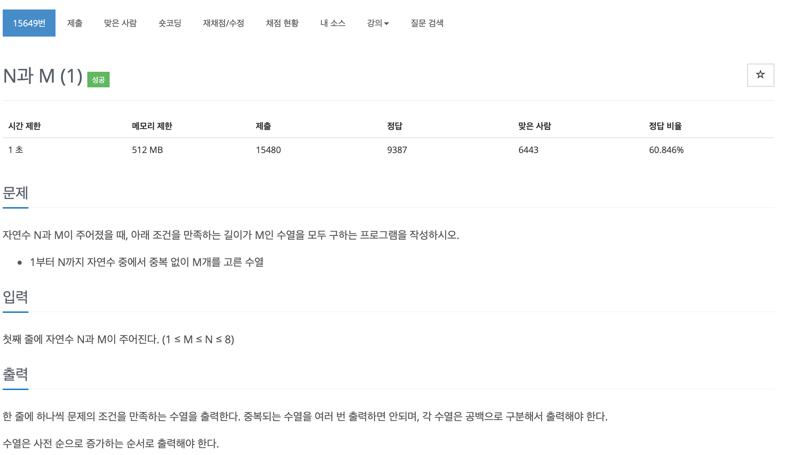

## 문제[#](https://programmers.co.kr/learn/courses/30/lessons/15649)



## 풀이 및 주저리..

5월 12일에 오는 백준 알고리즘 오프라인 강의를 듣기전에 풀어보는 1일차의 첫 번째 문제였다. 문제는 간단해보이지만, 재귀에 대한 개념부족과 DFS 문제에 너무 약해서 몇시간이 걸려도 결국 풀지 못하고 구글링하여 다른 사람들의 답을 볼 수 밖에 없었던 문제다. 

답을 보면 흐름을 알고 좀 따라갈 수 있었지만 비슷한 유형의 다른문제가 나올시에 풀기가 매우 힘들것 같다는 생각을 했다. 문제에 대한 접근방식이 부족한 것도 있고 방문처리를 하고 순열을 출력한후 백트래킹 하는 작업이 너무 어색하고 아직 머리속으로 정리되지 않은 느낌이였다. 넘어야할 큰 산을 만난 느낌이라 좀 많이 힘들지만 계속해서 풀다보면 쉬워지는 날이 올 것 같다. 

## 코드

```java
package baekjoon.algorithm.day01;

import java.util.Scanner;

public class NandM1 {

	static int[] list;
	static boolean[] bool;
	static int N, M;

	public static void main(String[] args) {
		Scanner scanner = new Scanner(System.in);
		N = scanner.nextInt();
		M = scanner.nextInt();

		list = new int[M];
		bool = new boolean[N + 1];
		
		solution(0);
	}

	public static void solution(int num) {
		if (num == M) {
			for (int i = 0; i < M; i++) {
				System.out.print(list[i] + " ");
			}
			System.out.println();
			return;
		}

		for (int i = 1; i <= N; i++) {
			if(bool[i] == true) continue;
			bool[i] = true;
			list[num] = i;
			solution(num + 1);
			bool[i] = false;
		}
	}

}

```

## 기억에 남길 것!

- 방문 처리와 백트래킹

