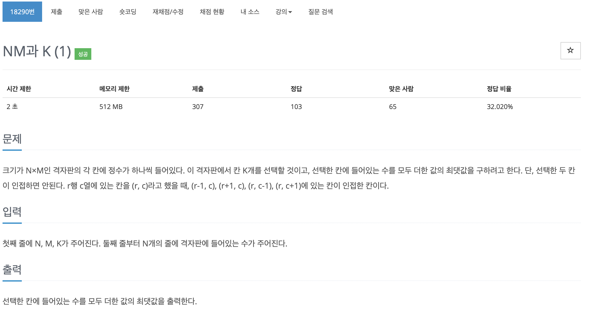

## 문제[#](https://www.acmicpc.net/problem/18290)



## 풀이 및 주저리..

백준 오프라인 강의를 준비하기 위해 풀었던 문제면서 힘들게 푼 문제이다. 전에 N 과 M 의 형태에서 좀 더 나아가 K 까지 등장한다. 전에는 방문했던 부분이 본인만 이였다면 이번에는 주변까지 확장시켜서 검사를 해나가야 하는 문제이다. 처음에는 `map_bool` 쪽을 단순하게 `boolean` 타입의 배열로 하다가 시간을 꽤 많이 사용하였다. 물론.. 내 실력 부족으로 처리를 못 해준것 같기도하지만,,

처음에 `boolean` 으로 하니 주변 방문의 겹치는 부분을 처리해주기 매우 난감하였다. 예를 들면, 

1 2

3 4 

에서 1을 방문하게 되면 

T T

T F

로 였다가 2,2 를 방문시 

T T

T T

에서 2,2 의 방문해제를 할경우

T F

F F 

가 되어서 후에 2,1 을 방문하게 되어 문제가 발생한다.

이 경우를 `int` 배열로 변경해 한번 방문시 수를 높여가는 방법으로 해결하였다. 분명 이거보다 좋은 방법이 있을거라고 생각하는데 오프라인 강의를 가서 더 좋은 방법을 알게된다면 글을 수정하여야 겠다. 

## 코드

```java
package baekjoon.algorithm.day01;

import java.io.BufferedReader;
import java.io.IOException;
import java.io.InputStreamReader;

public class NMandK {

	static int[][] map;
	static int[][] map_bool;
	static int N, M, K;
	static int max = -40001;
	static int[] list;

	public static void main(String[] args) throws IOException {
		BufferedReader br = new BufferedReader(new InputStreamReader(System.in));
		String[] NMK = br.readLine().split(" ");
		N = Integer.parseInt(NMK[0]);
		M = Integer.parseInt(NMK[1]);
		K = Integer.parseInt(NMK[2]);

		list = new int[K];

		map = new int[N][M];
		map_bool = new int[N][M];
		for (int i = 0; i < N; i++) {
			String[] input = br.readLine().split(" ");
			for (int j = 0; j < M; j++) {
				map[i][j] = Integer.parseInt(input[j]);
			}
		}
		sol(0);

		System.out.println(max);

	}

	public static void sol(int num) {
		if (num == K) {
			int temp = 0;
			for (int i : list) {
				temp += i;
			}
			max = Math.max(max, temp);
			return;
		}

		for (int i = 0; i < N; i++) {
			for (int j = 0; j < M; j++) {
				if (map_bool[i][j] > 0)
					continue;
				check(j, i);
				list[num] = map[i][j];
				sol(num + 1);
				uncheck(j, i);
			}
		}
	}

	public static void check(int x, int y) {
		map_bool[y][x]++;
		if (x - 1 >= 0)
			map_bool[y][x - 1]++;
		if (y - 1 >= 0)
			map_bool[y - 1][x]++;
		if (x + 1 < M)
			map_bool[y][x + 1]++;
		if (y + 1 < N)
			map_bool[y + 1][x]++;
	}

	public static void uncheck(int x, int y) {
		map_bool[y][x]--;
		if (x - 1 >= 0)
			map_bool[y][x - 1]--;
		if (y - 1 >= 0)
			map_bool[y - 1][x]--;
		if (x + 1 < M)
			map_bool[y][x + 1]--;
		if (y + 1 < N)
			map_bool[y + 1][x]--;
	}
}

```

## 기억에 남길 것!

- 너무 단순하게만 생각하지 말 것, 방문처리는 boolean int 등등 다양한 데이터 타입으로도 해결할 수 있다.

