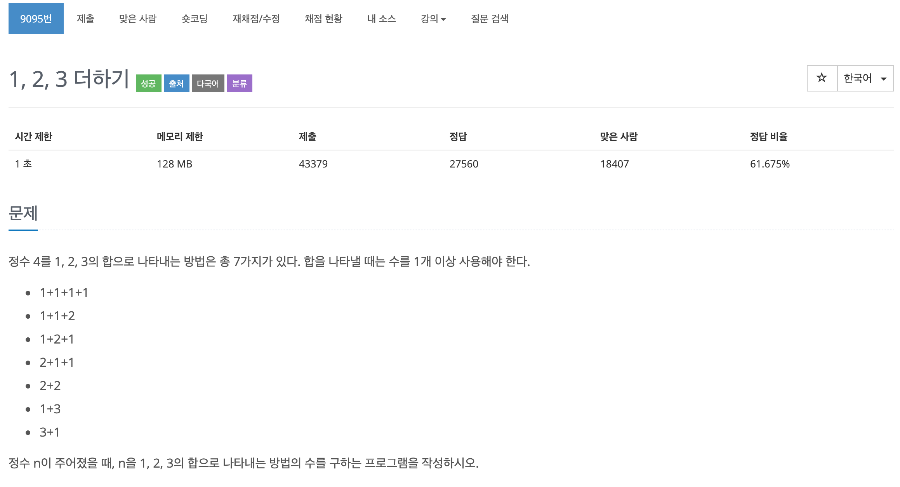

## 문제[#](https://www.acmicpc.net/problem/9095)



## 풀이 및 주저리..

전 문제에 이어서 바로 풀어본 문제이다. DFS 쪽만 계속해서 풀다보니 빠른 속도로 풀 수 있었다. 살짝 아쉬운것은 동적계획법처럼 이미 들어있는 답은 바로 출력을 해주고 싶었는데 시간안에 해결하지 못한 것이다. 재귀에 조금 익숙해진 것 같은 기분이 들어 좋았다. 

## 코드

```java
package baekjoon.algorithm.day01;

import java.io.BufferedReader;
import java.io.IOException;
import java.io.InputStreamReader;

public class Plus123 {

	static int answer;

	public static void main(String[] args) throws IOException {
		int[] answer_num;
		
		BufferedReader br = new BufferedReader(new InputStreamReader(System.in));
		int t_case = Integer.parseInt(br.readLine());
		answer_num = new int[t_case];

		for (int i = 0; i < t_case; i++) {
			answer = 0;
			sol(0, Integer.parseInt(br.readLine()));
			answer_num[i] = answer;
		}
		
		for (int i : answer_num) {
			System.out.println(i);
		}
		

	}

	public static void sol(int start, int purpose_num) {
		if (start == purpose_num) {
			answer++;
			return;
		}

		if (start < purpose_num) {
			for(int i = 1; i<=3; i++) {
				sol(start + i, purpose_num);
			}
		}
	}

}

```

## 기억에 남길 것!

- 방문처리와 재귀

