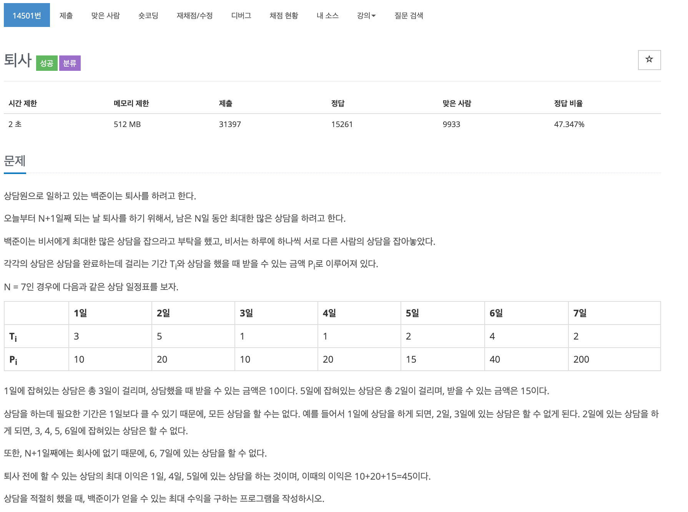

## 문제[#](https://www.acmicpc.net/problem/14501)



## 풀이 및 주저리..

간단하게 생각하면 쉽게 풀 수 있는 문제였는데 문제 이해력이 딸려서 오래 걸렸던 문제였다. **상담을 적절히 했을 때,** 이 말을 상담을 가장 많이 했을때 최대 수익이 구하는 문제인줄 알고 계속해서 이상한 풀이로 문제를 제출하였다.. 그냥 최대 수익을 갖는 문제였는데.. 그래서 결국 당일날에 못풀고 다음날에 다시 도전했는데 이상한 점을 발견해서 쉽게 풀 수 있었다. 

 먼저 일하는 날과 얻을 수 있는 수익을 배열로 만들어 저장해 두고 DPS 로 문제를 풀었다. 풀고나서 구글링 해보니 DP 로도 풀 수 있는 문제인 것 같은데, 좀 더 고민하고 후에 다시 도전해봐야겠다.

## 코드

```java
package baekjoon.algorithm.day01;

import java.io.BufferedReader;
import java.io.IOException;
import java.io.InputStreamReader;

public class Resignation {

	static int max = 0;
	static int min_num = 0;
	static int N;
	static Work[] works;

	public static void main(String[] args) throws IOException {
		// TODO Auto-generated method stub
		BufferedReader br = new BufferedReader(new InputStreamReader(System.in));
		N = Integer.parseInt(br.readLine());
		works = new Work[N];
		for (int i = 0; i < N; i++) {
			String[] TP = br.readLine().split(" ");
			works[i] = new Work(Integer.parseInt(TP[0]), Integer.parseInt(TP[1]));
		}
		sol(0, 0, 0);

		System.out.println(max);

	}

	public static void sol(int day, int tem_max, int num) {
		if (day > N)
			return;

		if (day <= N) {
			max = Math.max(max, tem_max);
		}

		for (int i = day; i < N; i++) {
			sol(i + works[i].T, tem_max + works[i].P, num + 1);
		}
	}

}

class Work {
	int T;
	int P;

	public Work(int t, int p) {
		super();
		T = t;
		P = p;
	}

}

```

## 기억에 남길 것!

- 다시 문제를 잘 읽어보자..

