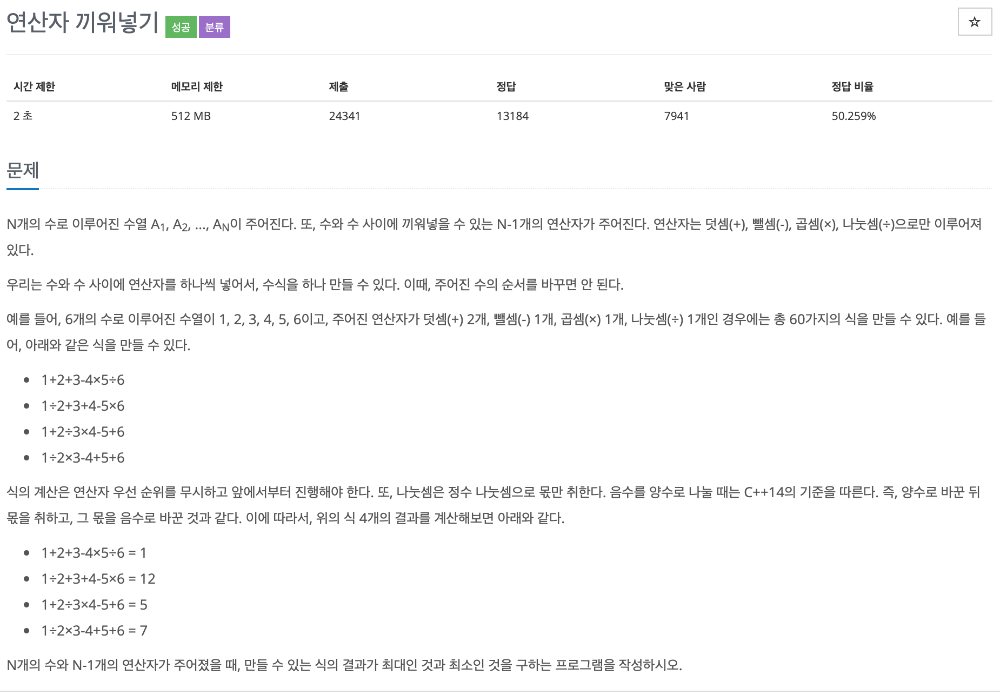

## 문제[#](https://www.acmicpc.net/problem/14888)



## 풀이 및 주저리..

백준 오프라인 강의의 day01 의 마지막 문제였다. 한참 고민을 하다가 결국 부호들의 순열들을 만들지 못해서 구글링을 하고 말았다. 다른 사람이 푼 코드를 보면서 느꼈던 것은 아직 내가 DFS쪽 개념을 코드로 옮기는 실력이 많이 부족하다고 생각됐고 그동안 풀었던 문제를 거의 외우다 싶이 풀었던 느낌을 받게 되었다. 문제를 풀기위해서 해결방법을 생각해야하는데 정해진 형식을 외워서 쓰다싶이 하니 문제를 풀 수 없었던 것 같다.

후에 강의를 듣고 다시 도전하러 와야겠다.

## 코드

```java
package baekjoon.algorithm.day01;

import java.io.BufferedReader;
import java.io.IOException;
import java.io.InputStreamReader;

public class InsertSign {

	static int N;
	static int max = Integer.MIN_VALUE;
	static int min = Integer.MAX_VALUE;
	static int[] input;

	public static void main(String[] args) throws IOException {
		BufferedReader br = new BufferedReader(new InputStreamReader(System.in));
		N = Integer.parseInt(br.readLine());
		input = new int[N];
		String[] inputes = br.readLine().split(" ");
		for (int i = 0; i < N; i++) {
			input[i] = Integer.parseInt(inputes[i]);
		}
		String[] signs = br.readLine().split(" ");
		int[] sign = new int[4];
		for (int i = 0; i < 4; i++) {
			sign[i] = Integer.parseInt(signs[i]);
		}
		dfs(1, sign[0], sign[1], sign[2], sign[3], input[0]);
		System.out.println(max);
		System.out.println(min);
	}

	public static void dfs(int cnt, int p_n, int m_n, int q_n, int d_n, int sum) {
		if (cnt == N) {
			max = Math.max(max, sum);
			min = Math.min(min, sum);
			return;
		}
		if (p_n - 1 >= 0)
			dfs(cnt + 1, p_n - 1, m_n, q_n, d_n, sum + input[cnt]);
		if (m_n - 1 >= 0)
			dfs(cnt + 1, p_n, m_n - 1, q_n, d_n, sum - input[cnt]);
		if (q_n - 1 >= 0)
			dfs(cnt + 1, p_n, m_n, q_n - 1, d_n, sum * input[cnt]);
		if (d_n - 1 >= 0)
			dfs(cnt + 1, p_n, m_n, q_n, d_n - 1, sum / input[cnt]);
	}

}

```

## 기억에 남길 것!

- 천천히 생각하고 코드를 외워서 풀지 말기!

