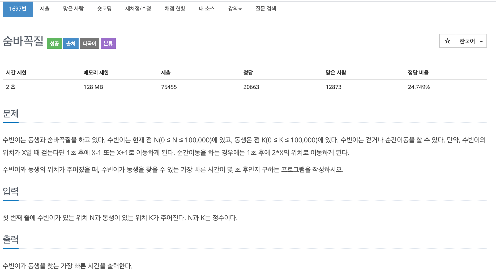

## 문제[#](https://www.acmicpc.net/problem/1697)



## 풀이 및 주저리..

백준 오프라인 강의의 day02 첫번째 문제이다. BFS 문제라는 것을 처음으로 접해봤고 문제를 풀기위해 하루정도 걸렸던 것 같다. 결국.. 구글링과 강의의 정답 코드를 보고야 이해가 갔다. 

못풀었던 이유로는 BFS 를 DFS 처럼 재귀 방식으로 푸려고 했던게 가장 큰 이유였던 것 같다. 이름이 비슷하다고 해서 풀이가 비슷한 것도 아니고.. 모든 문제를 재귀 방식으로 풀어야 하는것도 아닌데 말이다. 문제를 풀기위해서 유튜브에 있는 BFS 개념을 설명해주는걸 몇개를 봤는지 모르겠다.... 큐를 이용하는건 알겠는데 `time` 을 증가시키면서 진행하는 걸 이해하기가 정말 어려웠던 것 같다.  그리고 방법이 오로지 이 방법만 있는 건지.. 이게 최선인건지 좀 궁금해지는 문제였다. BFS 문제에 어색하니 좀 더 많이 풀면서 연습을 해봐야겠다.

후에 강의를 듣고 다시 도전하러 와야겠다.

## 코드

```java
package baekjoon.algorithm.day02;

import java.io.BufferedReader;
import java.io.IOException;
import java.io.InputStreamReader;
import java.util.LinkedList;
import java.util.Queue;

public class HideAndSeek1 {
	static final int MAX = 200000;
	static boolean[] pos_bool;
	static int[] list;
	static int sister_p;
	static Queue<Integer> que = new LinkedList<Integer>();

	public static void main(String[] args) throws IOException {
		BufferedReader br = new BufferedReader(new InputStreamReader(System.in));
		String[] input = br.readLine().split(" ");
		pos_bool = new boolean[MAX];
		list = new int[MAX];
		int subin_p = Integer.parseInt(input[0]);
		int sister_p = Integer.parseInt(input[1]);
		list[subin_p] = 0;
		que.add(subin_p);
		pos_bool[subin_p] = true;

		while (!que.isEmpty()) {
			int v = que.poll();

			if (v - 1 >= 0) {
				if (!pos_bool[v - 1]) {
					pos_bool[v - 1] = true;
					que.add(v - 1);
					list[v - 1] = list[v] + 1;
				}
			}
			
			if (v + 1 < MAX) {
				if (!pos_bool[v + 1]) {
					pos_bool[v + 1] = true;
					que.add(v + 1);
					list[v + 1] = list[v] + 1;
				}
			}
			if (v * 2 < MAX) {
				if (!pos_bool[v * 2]) {
					pos_bool[v * 2] = true;
					que.add(v * 2);
					list[v * 2] = list[v] + 1;
				}
			}
		}

		System.out.println(list[sister_p]);
	}

}

```

## 기억에 남길 것!

- DFS 는 재귀적으로 스택 , BFS 는 큐를 이용하자.

