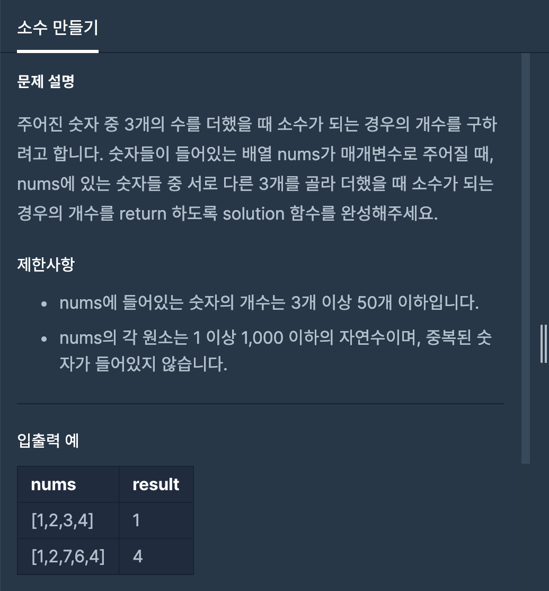

## 문제[#](https://programmers.co.kr/learn/courses/30/lessons/12977)



## 풀이 및 주저리..

프로그래머스 온라인 강의를 들으면서 다시 풀게된 문제이다. 문제자체는 좀 쉬운 편에 속하지만 전에는 재귀로 풀지 못했던 것을 재귀로 풀고 리뷰를 받으며 이런저런 팁들을 많이 알게되었다. 대표적으로 자바에서는 snake case를 쓰지 않는다는 것과 문제를 풀때 메소드를 잘 알고 사용해야지 좋은 것. 그냥 무작정 쓴다고 좋은 것이 아니라 그걸 쓰면 이런 부분에서 효율적인것을 알 때 쓰는 것이 중요했던 것 같다.

먼저 나는 소수를 구하기 위해서 에라스토의 체를 활용했고 그 다음 `boolean` 배열을 활용해서 후에 어떠한 값이 들어오더라도 바로 소수인 것을 알 수 있도록 만들어주었다. 후에 재귀를 할 경우 중복을 없애주기 위해서 반복문 안에서의  `i`를 `start` 부터 시작하여서 해결하였다.

## 코드

```java
package programmers.school.day01;

import java.util.ArrayList;

public class MakeBinaryNumber {
    static boolean[] boolArr;
	static ArrayList<Integer> binList;
	static int answer;

	public int solution(int[] nums) {
		answer = 0;
		boolArr = new boolean[3000];
		binList = new ArrayList<>();

		boolArr[2] = true;
		binList.add(2);
		for (int i = 3; i < boolArr.length; i += 2) {
			boolean isBin = true;
			for (int j : binList) {
				if (i % j == 0) {
					isBin = false;
					break;
				}
			}
			if (isBin) {
				boolArr[i] = true;
				binList.add(i);
			}
		}
		// 소수배열을 먼저 만들어놓고 해야함.
		dfs(0, nums, 0, 0);
		return answer;
	}


	public void dfs(int start, int[] nums, int num, int sum) {
		if (num == 3) {
			if (boolArr[sum])
				answer++;
			return;
		}
		for (int i = start; i < nums.length; i++) {
			dfs(i + 1, nums, num + 1, sum + nums[i]);
		}
	}
}

```

## 기억에 남길 것!

- 메소드나 풀이 방법을 무작정 사용하지말고 제대로 알고 나서 사용하기

