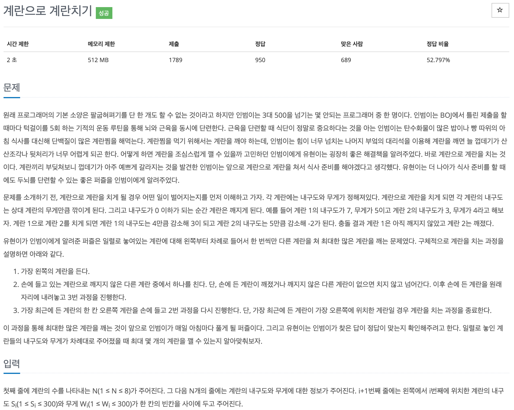

## 문제[#](https://www.acmicpc.net/problem/16987)



## 풀이 및 주저리..

백준 오프라인에서 브루트 포스 문제 중 좀 중요하다고 말씀해주신 문제이다. 브루트 포스에서 가장 중요한 부분은 일단 모든 상황을 다해보는 것이기 때문에 모든 상황을 코드로 구현 할 수 있어야한다. 그리고 재귀로 들어가는 부분에서의 결과처리가 중요하다고 생각하는데 이 문제는 그런것들이 다양하게 발생해서 그런 것 같았다.

풀이로는 먼저 계란의 내구도와 무게를 배열로 저장하고 계란을 차례대로 들어 남아있는 계란을 내려는것을 재귀로 구현한 형태이다. 여기서 좀 중요한 것은 상황들을 잘 이해하고 구현해야하는 것인데, 작성한 `isOne` 이라는 부분이 정답으로 가는 중요한 부분이였다. 이 부분이 없으면 들고있는 계란만 깨지지 않은 상태이고 나머지 계란이 모두 깨져있는 상태를 확인할 수 없이 재귀함수가 끝나버리기 때문에 문제를 풀수 없게 된다.


## 코드

```java
package baekjoon.algorithm.day04;

import java.util.Scanner;

public class EggToEgg {
	static int[] durability;
	static int[] weight;
	static int N;
	static int answer = 0;

	public static void main(String[] args) {
		Scanner s = new Scanner(System.in);
		N = s.nextInt();
		durability = new int[N];
		weight = new int[N];

		for (int i = 0; i < N; i++) {
			durability[i] = s.nextInt();
			weight[i] = s.nextInt();
		}
		go(0);
		System.out.println(answer);
		s.close();
	}

	public static void go(int index) {
		if (index == N) {
			int temp = 0;
			for (int i : durability) {
				if (i <= 0)
					temp++;
			}
			answer = Math.max(temp, answer);
			return;
		}

		if (durability[index] <= 0) {
			go(index + 1);
			return;
		}
		
		boolean isOne = true;

		for (int i = 0; i < N; i++) {
			/*
			 *  index 번째의 계란으로 안깨진 계란을 찾아서 친다.
			 */
			if (index == i)
				continue;
			if (durability[i] <= 0)
				continue;
			isOne = false;
			durability[i] -= weight[index];
			durability[index] -= weight[i];
			go(index + 1);
			durability[i] += weight[index];
			durability[index] += weight[i];
		}
		if(isOne) {
			go(index + 1);
		}
	}

}

```

## 기억에 남길 것!

- Brute Force에서 가장 중요한건 모든 상황을 구현할 수 있는 능력

