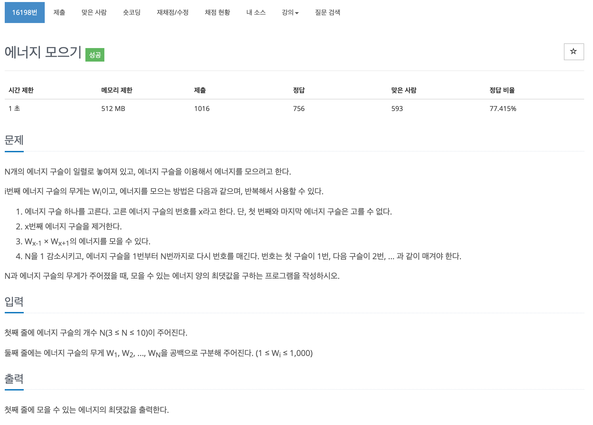

## 문제[#](https://www.acmicpc.net/problem/16198)



## 풀이 및 주저리..

처음에 쉬운 문제라고 생각하고 접근했다가 결국 못풀고 몇일이 지나서 다시 도전해 풀게된 문제이다. 처음 도전에 실패했던 이유는 그리디 문제라고 생각했기 때문이다. 상황에 맞는 최선의 선택이 가장 최대값으로 간다고 생각했지만, 전혀 그런 문제가 아닌 브루트 포스의 문제였기에 풀지 못했었다. 좌우의 값이 최대가 되는 경우가 두가지 이상 존재할 경우 어떤 것을 선택해야지 그것이 최선인지 알 수 없기 때문이다. 그래서 다시 도전할 때는 `boolean` 배열을 활용해서 풀어보았다. 결국 마지막에 남는것은 1번째와 N번째 구슬이기에 사용해서 삭제해준 구슬은 점검을 하는 방식으로 해결할 수 있었다.


## 코드

```java
package baekjoon.algorithm.day03;

import java.util.Scanner;

public class EnergyCollect2 {
	static int MAX = Integer.MIN_VALUE;
	static int[] energyArr;
	static boolean[] energyBool;

	public static void main(String[] args) {
		Scanner scanner = new Scanner(System.in);
		int N = scanner.nextInt();
		energyArr = new int[N];
		energyBool = new boolean[N];
		for (int i = 0; i < N; i++) {
			energyArr[i] = scanner.nextInt();
		}
		go(0, 0);
		System.out.println(MAX);
		scanner.close();

	}

	public static void go(int sum, int index) {
		if (index == energyBool.length - 2) {
			MAX = Math.max(MAX, sum);
			return;
		}
		for (int i = 1; i < energyBool.length - 1; i++) {
			if (energyBool[i])
				continue;
			int l = i - 1;
			int r = i + 1;
			while (energyBool[l]) l--;
			int left = energyArr[l];
			
			while (energyBool[r])r++;
			int right = energyArr[r];
			
			int temp = left * right;

			energyBool[i] = true;
			go(sum + temp, index + 1);
			energyBool[i] = false;
		}
	}

}

```

## 기억에 남길 것!

- 문제를 읽고 이 문제가 어떤 문제인지 알아야한다.

