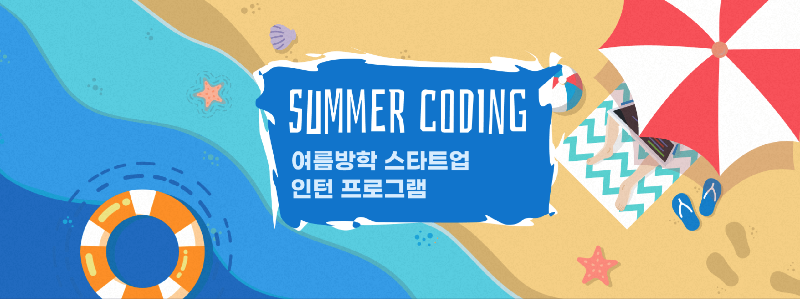

저번에 봤던 [2020 Dev Matching 웹 백엔드](https://choihwan2.github.io/programmers-backend/) 에 이어서 프로그래머스에서 본 두번째 코딩테스트 였다. 근래에 봤던 소프트마에스트로 2차 코딩테스트 이후 좀 크게 슬럼프가 온 것 같아서 이것저것 알고리즘 강의들을 신청하고 DFS 와 BFS 를 활용한 문제들을 풀면서 지내고 있었다. 진행중인 국비지원 과정이 막바지라 파이널 프로젝트 때문에도 꽤 바쁜 시기여서 따로 더 준비를 하거나 그런것은 아니고 저번과 비슷한 난이도면 모든 문제를 풀어보자! 라는 생각으로 시작했던 것 같다.

난이도는 개인적으로 저번 웹 백엔드 보다는 어려웠던 것 같고 특이하게 수학적인 사고를 요구하는 문제가 나왔던 것 같다. 다른 방법으로도 풀 수 있을까? 생각해봤지만 내 생각에는 어려울 것 같은 문제가 나왔고 SQL 문제에서는 처음으로 테이블 세개를 다루는 문제를 풀어보게 되었다. 결과적으로는 4문제중에 3문제를 풀고 나머지 한문제를 풀지 못하였지만, 과거에 비하면 나름 좋은 성장이였던 것 같다. 아쉽게 생각이 드는 것은 분명 재귀적으로 해결하거나 좀 더 좋은 방법으로 풀 수 있었떤 문제들이 있었는데 (대표적으로 1번) 처음 시작할때 긴장을 해서 그런지 깔끔하게 구현하지 못하고 중복적인 코드가 좀 발생 했던 것이다. 재귀적인 방법으로도 더 쉽고 깔끔하게 구현할 수 있던 문제가 있었는데.. 아직까지 자유롭게 그런 코드들을 작성하기엔 실력이 많이 부족한 느낌이였다. 

아마 앞으로 2020 하반기에는 SSAFY 지원과 부스트캠프 지원을 하고 나서 두개의 결과에 따라서 아마 내 개발자로서 어디로 향하느냐가 정확하게 정해질 것 같다. 물론 이 인턴 프로그램도 있으니깐.. 세개일 수도..? 좋은 결과가 있었으면 좋겠지만 아직 갈길이 멀다고 생각한다. 최근들어 이것저것 마음고생이 많은데 취준생이라면 다 겪고 넘어가는 문제들이라고 생각하면서 넘어가야지.. 슬럼프가 온다는 것 자체가 이미 잘하고 있다는 좋은 말이 참 힘이 됐던 것 같다. 취준생 화이팅!