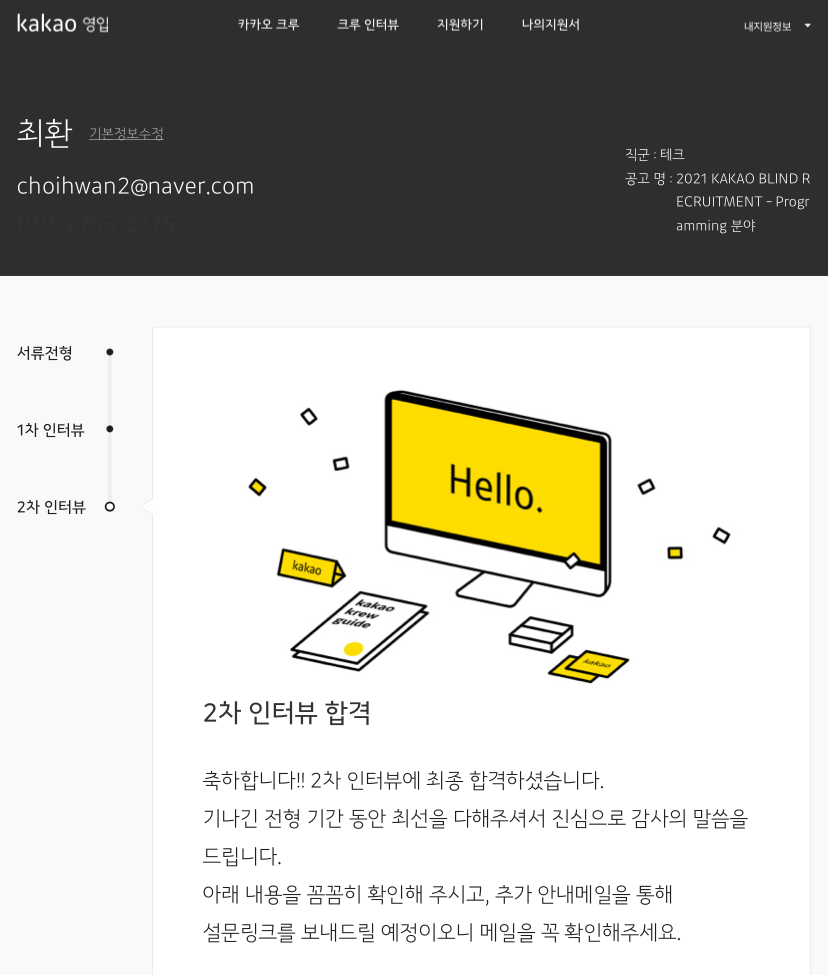

## 2차 인터뷰

전에 쓴 글에서 쓰다싶이 1차 인터뷰를 보고 2차 인터뷰를 보게 되었다. 인터뷰는 보안상 간략하게 말하면.. 인성면접이였고 개발자가 어느방향을 가지고 있는지, 지금까지 어떻게 해왔는지를 묻는 듯한 느낌을 받는 면접이였던 것 같다. 인터뷰 도중 준비를 못한 부분도 당연히 있었고, 준비했던 것을 모두 다 보여드리지는 못한 것 같아서 아쉬움이 남았지만, 자신감 있게 대답을 했던 것 같다. 결과는 정말.. 운이 좋게도 합격..을 하게 되었다..ㅠㅠ... 싸피 교육과정을 대전에서 듣기 때문에 짐싸고 대전가려고 했는데 합격된거 보고 다시 집으로 와서 조금 울다가 다시 대전으로 내려갔다.. 그동안 참 많은 사람들한테 도움을 받았고 특히, 재수생활을 통해서 게임을 좋아하는 한가지 이유로 컴퓨터관련학과로 와서.. 4학년 1학기까지 자바의 배열이 List 인줄 알고 있던 나와 같이 안드로이드 모바일 앱 개발 주제로 캡스톤 프로젝트로 (ㅋㅋㅋㅋ생각해보니 너무 심각하다) 하자고 했던 [친구](https://github.com/doong-jo)한테 특히 감사하다. 정말 아무리 다시 생각해도 이 친구 없이는 내가 컴퓨터쪽으로 취업을 못했을 것 같다. 그외에 부캠하느라 바쁜데 도와준 기술면접 일주일 내내 도와준 [친구](https://zin0-0.tistory.com/).. 같이 멀캠때 힘들었던 사람들, 그리고 지금 싸피에서 고생중인 사람들 다들 너무 감사하고.. 전에 썼던 글처럼 베풀수 있는 개발자가 될 수 있도록 하겠다. 화이팅!

## 보관용..

> 참고로 지원한 부분은 카카오 본사 Programming 분야이다.